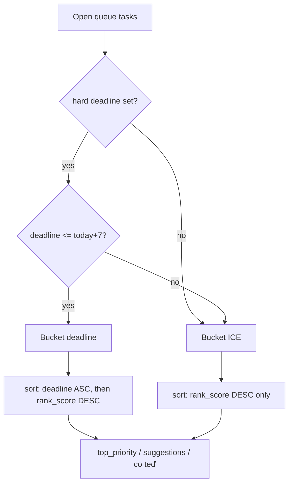

# Deadline bucket + firemní priority → ranking

## Rozhodnutí (z odpovědí)

| # | Volba |
|---|---|
| Sort „co teď“ | Bucket **hard `deadline` ≤ today+7** (včetně overdue) **striktně nad** zbytek; uvnitř bucketu deadline ASC, pak skóre |
| Overdue | Ve stejném deadline bucketu |
| `review_deadline` | **Bez vlivu na pořadí**; dál exclusive s `deadline`, dál pro Rozhodni / due když není hard deadline |
| Vazba | Volitelné `company_priorities:` (prázdné = OK) |
| Scope | Jen **9 aktivních** z listu 2HY 2026 (G) |
| Sync sheet | Jednorázový export; další update až řekneš |
| Dopad | `top_priority`, `focus_suggestions`, řazení v `agenda-co-ted` (ne jen chat heuristika) |

`top_priority_today` zůstává **eligibility = lidský `focus`**; mění se jen **pořadí uvnitř** a ranking suggestions / širší `top_priority`.

## Doporučení: company priority → skóre (otázka 4)

**Nedoporučuju přepisovat `ice_i` / `ice_c` při linku.** ICE = „jak důležitá je ta konkrétní práce“; firemní priorita je **ortogonální osa**. Mutace I/C by zkreslila lidský odhad a při re-triáži by se boost sčítal znovu.

**Doporučení: pevný additive bonus**

```text
priority_score = (ice_i * ice_c) / ice_e          # beze změny
company_bonus  = COMPANY_PRIORITY_BONUS (5) pokud company_priorities neprázdné, jinak 0
rank_score     = priority_score + company_bonus   # (v deadline bucketu bez starých urgency +30/+20)
```

Proč **+5**: typické ICE je ~3–40; +5 posune aligned task uvnitř pásma (vyhraje nad stejně těžkým nealigned), ale nevyhraje samo nad silným 9×9/E3. Počet linků **neškálovat** (1 priorita stačí; víc linků ≠ víc bodů — ať se nelinkuje spam).

Skills (triage/capture): při neprázdném `company_priorities` **navrhni vyšší I/C v přirozeném rozsahu** (např. I/C spíš 7–9 než 4–5), ale mechanický ranking drží `company_bonus`.

Staré urgency (+30 dnes / +20 review) v `today_score` **nahradí** dvoubucket sort — jinak by „zítra“ pořád přebíjelo ICE mimo bucket nestabilně. Deadline bucket = tvrdá priorita; uvnitř jen datum + `rank_score`.



## Vault: struktura priorit (jednorázový export)

Zdroj: [Roadmapa EDU / 2HY 2026](https://docs.google.com/spreadsheets/d/1UFhQbHnpj-JN1kQPKUsdMGVxlEkUZwefBa8MVPWwEAw/edit?gid=1942186510) — G = název, C/I/J/K (+ B/D) do body.

- Hub: [`OBSIDIAN/00-System/Memory/firemni-priority-2hy-2026.md`](OBSIDIAN/00-System/Memory/firemni-priority-2hy-2026.md) — index 9 priorit, odkaz na sheet, pravidlo ICE/bonus, „sidelined“ jen zmínka bez stránek.
- Jedna stránka: `OBSIDIAN/00-System/Memory/priority/CP<N> — <Title>.md`

```yaml
---
type: company_priority
id: CP8
slug: exponential-summit
title: Exponential Summit
status: active
period: 2026-H2
sheet_row: 8
aliases: [CP8]
---
```

Body sekce: Kontext (C) · Proč (B) · CO (D) · Cíl 2HY (I) · DoD (J) · Náročnost (K).

| ID | Title (z G, zkrácené) |
|---|---|
| CP1 | Identita EDU |
| CP2 | Ways of working |
| CP3 | IT & Data team |
| CP4 | Struktura dat pro AI agenty |
| CP5 | Vytěžování dat pro Sales a KAM |
| CP6 | Key account management |
| CP7 | EDUtéka |
| CP8 | Exponential Summit |
| CP9 | Procesní jasnost Delivery |

Na task/story/epic:

```yaml
company_priorities: []   # nebo
company_priorities:
  - "[[CP8 — Exponential Summit]]"
```

Prázdné = validní. Boost platí při **alespoň jednom** platném wikilinku; parent epic se **neinferuje automaticky** v kódu (agent při zápisu může zkopírovat z parenta ručně / v preview).

## Kód (SSOT)

Pipeline: **ano** — změna [`vps/second-brain-hub/lib/today_priority.py`](vps/second-brain-hub/lib/today_priority.py) + **oba** buildery ([`scripts/build_agent_context.py`](scripts/build_agent_context.py) **a** [`vps/second-brain-hub/cron/build_agent_context.py`](vps/second-brain-hub/cron/build_agent_context.py)) + tests.

1. **`rank_score` / `rank_key`** v `today_priority.py` (jediná SSOT funkce):
   - `DEADLINE_HORIZON_DAYS = 7`, `COMPANY_PRIORITY_BONUS = 5`
   - `in_deadline_bucket` = hard deadline and `deadline <= today + 7d` (vč. overdue)
   - `company_bonus` = +5 při ≥1 neprázdném stringu po strip (`""`/`—` = 0; bez FS check)
   - `rank_key` = `(0, deadline, -rank_score)` | `(1, date.max, -rank_score)` — ICE bucket **vždy** sentinel datum
   - Řazení: `sorted(tasks, key=lambda t: rank_key(t, today))` — **ascending, bez `reverse=True`** (tuple nese `-rank_score`)
   - Snapshot: model B — pre-sorted pole + `in_deadline_bucket` / `rank_score` / `company_bonus`; `today_score` = `rank_score`; `urgency_bonus` pryč z rankingu; skills neresortují
2. **`lifecycle_promotion.select_focus_suggestions`**: jen `rank_key` (ne starý urgency `task_today_score`).
3. **`hub_state`**: povinně stejný `rank_key` pro top Doing/Next.
4. **Parsování** `company_priorities` v TaskInfo / to_dict / VPS `task_to_dict` + enrich — **oba** buildery.
5. **Testy** [`test_today_priority.py`](vps/second-brain-hub/tests/test_today_priority.py) (+ lifecycle, hub_state): B1–B9 / T1–T9.
6. **Bases (ŠABLONY + živý vault):** flat + hierarchy — `today_score` jen deadline-week `+1000`; **smazat** review větev i formula `urgency_bonus` / `review_urgency`; company bonus ne. Zkopírovat do `OBSIDIAN/00-System/Bases/`.
7. **Šablony + skills**: task/epic template, capture/triage/co-ted/priority-review, convention, bootstrap — `company_priorities`; **zákaz re-sortu**; smazat „Sort: today_score DESC“.
8. **`priority_rules` v obou builderech** (local **i** VPS cron): `sort: rank_key (...); arrays pre-sorted; do not re-sort by today_score`; bez legacy urgency tabulky.
9. **`focus_suggestions` enrich v obou builderech:** po `select_focus_suggestions` stejný enrich jako `top_priority` (T5: pořadí + pole).
10. **B9/T9 hub_state:** low-ICE v deadline bucketu před high-ICE mimo bucket v TOP3 `## Stav (auto)`.

## Mimo scope

- Automatický sync ze Sheetu
- Stránky pro sidelined (Anti-Švarc, LD, …) — jen zmínka v hubu
- Povinný backfill `company_priorities` na existující tasky (agent doplní při triáži / až řekneš sweep)
- Změna významu Rozhodni (`due < today` dál z deadline nebo review)

## Critic r1 ([rbu-plan-critic](8c617c7d-279b-4584-a713-fc695f1daff4)) — K PŘEPRACOVÁNÍ

### Opravy zapracované do plánu (nečekají na Tebe)

**NEW-1 BLOCKER — sort key v ICE bucketu:** jeden helper `rank_key(task, today) -> tuple`:
- `(0, deadline_date, -rank_score)` pokud `in_deadline_bucket`
- `(1, date.max, -rank_score)` jinak — **vždy sentinel** na datumové ose v ICE bucketu (far-deadline nesmí předběhnout vysoké ICE bez deadline).

**NEW-3 MAJOR — Bases:** přepsat `today_score` / urgency: jen deadline-week `+1000` z hard `deadline`; **smazat** review větev z formula `today_score`; company bonus v Bases ne; odchylka v `priority_rules`.

**NEW-4 MAJOR — parse:** `company_priorities: list[str]` v `TaskInfo` / `to_dict` / VPS `task_to_dict` + `_list_str`; `company_bonus` čte i z frontmatter v suggestion path.

**NEW-5 MAJOR — hub_state:** povinně stejný `rank_key` pro Doing/Next top3 (ne „pokud“).

**NEW-6 MAJOR — B#/T#:**

| ID | Chování | Test |
|---|---|---|
| B1 | deadline ≤7d vždy před mimo-bucket | T1 |
| B2 | overdue hard deadline v bucketu | T2 |
| B3 | review_deadline neovlivní `rank_key` | T3 |
| B4 | ≥1 neprázdný string po strip → +5; `""`/`—`/whitespace → 0 | T4 (+ negativní case) |
| B5 | `focus_suggestions` stejný `rank_key` | T5 |
| B6 | Rozhodni / `effective_due` exclusive beze změny | T6 |
| B7 | hranice den 7 v bucketu, den 8 mimo | T7 |
| B8 | uvnitř bucketu deadline ASC, pak rank_score | T8 |
| B9 | hub_state TOP3 stejný `rank_key` (deadline bucket před high ICE mimo) | T9 |

Přepsat staré urgency/overdue testy v `test_today_priority.py` (+ lifecycle suggestions + hub_state).

**NEW-8–11 (r1):** DRY `rank_key`; P N/A; scrub claude docs; due_soon/needs_decision beze změny.

### Critic r2 ([rbu-plan-critic](c2b03b3d-4eec-4207-8a47-662b0802e7c1)) — zapracováno

NEW-3 vault Bases · NEW-12 enrich suggestions · NEW-14 no re-sort · NEW-15 B4 · NEW-16 B9

### Critic r3 ([rbu-plan-critic](30fec483-90f6-4117-8e36-9b5eb114dd6c)) — zapracováno

NEW-12 VPS cron builder · NEW-17 ascending sort · NEW-18 smazat Bases urgency formulas

### Critic r4 ([rbu-plan-critic](b452f441-d808-4cdd-bfa9-9b506ee2b9e4)) — **SCHVÁLENO**

0 BLOCKER, 0 MAJOR. NEW-1..18 uzavřené.

### Rozhodnutí uživatele (2026-10-03)

| OPEN | Volba |
|---|---|
| NEW-2 | **B** — pre-sorted + pole; skills neresortují; Bases `+1000` aproximace |
| NEW-7 | strip neprázdný string; bez FS/whitelist |
| B8 | ASC overdue first uvnitř deadline bucketu |

`today_score` = `rank_score`; pořadí = pořadí v poli.

## Po schválení (implementace)

Implement → diff-review → pytest → commit/push hub; vault CP pages + Bases sync; TESTER: přeskočeno (SECOND_BRAIN).
