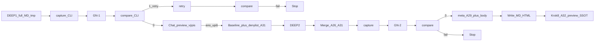

# Plán: grammar-nazi v zápisu ze schůzky

Autor: rbu-architect, otevření #1, generace **k=3**, kolo **r=1** (převzetí po C9–C11).  
Ledger: [2026-10-07-grammar-nazi-zapisy.pipeline.md](file:///Users/lukascypra/My%20Drive%20(lukas@redbuttonedu.cz)/SECOND_BRAIN/docs/plans/2026-10-07-grammar-nazi-zapisy.pipeline.md).

## Zadání a požadavky

| R# | Požadavek | Zdroj |
|---|---|---|
| R1 | Vytvořit extra agenta `grammar-nazi`, který projde veškeré texty zápisu a opraví překlepy, skloňování, časování a další gramatické hrubky. | Zadání bod 1 |
| R2 | Stejný agent dohlíží na tone-of-voice — **jen vybraná vrstva** z rbe (viz A8 / A25 include/exclude), ne offer/marketing. | Zadání bod 2 + CLARIFY 1 + **C5** |
| R3 | Běží **před** chat preview (nad úplným MD draftem). | CLARIFY 2 + **C1** |
| R4 | Prochází **celý** zápis (úplný MD, ne jen chat výpis). | CLARIFY 3 + **C1** |
| R5 | Whitelist faktů; morfologie jen **uvnitř** položky; nesmí přidat/odebrat/sloučit bullet; bitově neměnit YAML klíče, enumy, `name_aliases`, cesty, owner/key_people/status, smysl úkolu. | CLARIFY 4 + g=1–g=4 |
| R6 | Tichý přepis; výjimka: fail fingerprint → 1 věta + stop write. | CLARIFY 5 + g=1 Q5 |
| R7 | Stejná pravidla pro Claude Team. | CLARIFY 6 |
| R8 | EN / smíšené CS+EN. | CLARIFY 7 |
| R9 | Flow: **DEEP#1** úplný MD (tmp OK) → capture → GN-1 → compare → **chat preview** (výpis z post-GN MD + editovatelná tabulka úkolů) → po „ano“/„upiš“: aplikuj preview edit → **DEEP#2** z přepisu → **merge A26+A31** → capture → GN-2 → compare → meta+body z post-GN MD → write; **Krok 8** dle **A32** (upravený preview). | g=1 Q4 + g=2 Q1 + **C1** + **C4** + **C9** + **C10** |
| R10 | `rbe-writing-style` dál vylučuje zápisy. | Nutný důsledek |
| R11 | Cursor: skill + cursor-agent + install symlinky. | Install mezera |
| R12 | Claude ZIP (obsah A23, cesta A27). | g=1 Q1 + **C7** |
| R13 | Fingerprint compare; 1× retry; 2. fail → stop. | g=1 Q5 + R17 |
| R14 | Citáty neopravovat. | g=1 Q6 |
| R15 | Chráněné spany — GN instrukce; fingerprint je nehashuje jako content. | g=2 Q3 + g=4 |
| R16 | Anti-AI self-contained v meeting-language. | g=2 Q4 |
| R17 | Fingerprint = struktura + počty + bitová pole (A18); žádný content hash bulletů/buněk. | g=3 Q1 + g=4 Q1 B |
| R18 | Cardinality Co zaznělo / tasks / highlights; `**tasks** — žádné` ⇒ `tasks_count=0` (A28). | g=3–g=4 + **C8** |
| R19 | `body.html` 1:1 z post-GN MD; `meta.json` **deterministicky odvozen** z post-GN MD (A29) — žádný volný styl / 2. language pass; žádný MD↔HTML content hash (A24). | g=3 Q3 + **C2** |
| R20 | MD schéma: pod `## 0. Meta` povinně `### Highlights` + přesně 3 top-level `-` (full; shared dle A21). | **C3** |
| R21 | CLI `md_fingerprint.py` capture/compare s exit 0/1/2 (A33); skill F4 cituje příkazy; T6/T7 proti CLI. | **C11** |

**Mimo rozsah:** změna `build_html.py` shellu; automatický MD→HTML produkt; MD↔HTML hash gate; rozšíření `rbe-writing-style`; `rbu-*` agent; vault task; Coolify; Alembic/RBAC/Celery/MCP/frontend (netýká se — profil SECOND_BRAIN).

## Předpoklady

| A# | Předpoklad | Proč |
|---|---|---|
| A1 | **Úplný MD DEEP#1** (tmp soubor OK, např. `/tmp/…_zapis.draft.md`) vzniká **před** GN-1 a před chat preview. Chat preview **smí** zůstat stručný výpis (highlights + tabulka úkolů + meta) z **post-GN-1** MD — to není náhrada úplného draftu. Věty ve skillu typu „hloubka / plný zápis začíná až po ano“ se **přepíšou**: plná hloubka DEEP#1 existuje už před preview; po ano jde o **DEEP#2 refresh** + merge, ne o první vznik hloubky. | **C1**; důkaz konfliktu: [`SKILL.md`](file:///Users/lukascypra/My%20Drive%20(lukas@redbuttonedu.cz)/SECOND_BRAIN/%C5%A0ABLONY/skills/agenda-zapis-ze-schuzky/SKILL.md) ř. 111–113, 320–321 vs R3/R4 |
| A2 | Jedna pravda obsahu zápisu = MD; po compare OK → `body.html` + `meta.json` z post-GN MD; `build_html.py` jen shell. | g=2 Q1 |
| A3 | Cursor agent readonly. | Oddělení |
| A4 | Bez Cursor agentu → inline / in-process GN. | R7, A23 |
| A5 | Cursor: GN oddělený kontext OK; Claude: in-process (A23). | A23 |
| A6 | *(superseded A17)* | |
| A7 | Whitelist faktů. | R5 |
| A8 | Vybraná rbe vrstva — detail include/exclude = **A25**. | R2, **C5** |
| A9 | EN: opravovat v jazyce úseku. | R8 |
| A10 | Shared: chybějící sekce OK; highlights viz A21. | |
| A11 | Chunking jen v GN; capture/compare celý MD (A22). | |
| A12 | Citáty. | R14 |
| A13 | Po „ano“: DEEP#2 → **merge A26+A31** → capture → GN-2 → compare → meta/body → write; Krok 8 dle **A32**. | R9, **C4**, **C9**, **C10** |
| A14 | Retry + stop. | R13 |
| A15 | Claude ZIP = A23 + cesta A27. | **C7** |
| A16 | Spany: GN instrukce; fingerprint nehashuje wording. | |
| A17 | meeting-language self-contained (+ A25). | |
| A18 | Fingerprint pole: (1) pořadí `##`; (2) množina/počet `id:`; (3) počet řádků konsolidované tabulky (ne text Úkol/Kontext); (4) YAML klíče; (5) enum/status_values; (6) name_aliases bitově; (7) owner/key_people/status bitově; (8) highlights_count z `### Highlights` top-level `-` (A30); (9) per-card počty Co zaznělo a tasks (A28 pro „žádné“). **NE** content hash bulletů/buněk. | g=4 Q1 B + C3 + C8 |
| A19 | GN jen uvnitř položky; full → highlights==3. | |
| A20 | HTML komponenty 1:1 text z MD; žádný 2. language pass. | |
| A21 | Highlights==3 i u shared, pokud blok `### Highlights` ve vstupu. | |
| A22 | Chunking jen v GN; capture/compare celý MD. | |
| A23 | ZIP obsah: SKILL + meeting-language + md_fingerprint.py (+ fixtures volitelně) + INSTALL; Claude in-process. | |
| A24 | Žádný MD↔HTML content hash. | |
| A25 | **meeting-language include:** přirozená CS/EN; anti-korpo; humanization (konkrétní > abstraktní); anti-AI cliché blacklist (self-contained). **Exclude:** claims/headline patterns, slide-and-offer-design, learning-design, investment/value-slide copy, „ty“/Slack registr. Neimportovat celé `rbe-writing-style/references/*`. | **C5** |
| A26 | **Merge po „ano“ (MD obsah — základní pravidla):** (1) karty / oblasti / **Co zaznělo** / status / owner / key_people / park / meta rámec = z **DEEP#2**; (2)–(4) tabulka + **tasks** u karet = dle **A31** (baseline + denylist); (5) teprve pak capture → GN-2. | **C4**; zpřesněno **C9** → A31 |
| A27 | ZIP výstupní cesta (jedna SSOT): `ŠABLONY/skills/grammar-nazi/dist/grammar-nazi-claude.zip` (+ INSTALL vedle). Volitelná kopie/material odkaz do `OBSIDIAN/02-PROJEKTY/it-ai-data/materials/` jen pokud existuje otevřený task — default = `dist/` v skillu. | **C7** |
| A28 | Marker `**tasks** — žádné` (nebo ekvivalent bez top-level `-` / `- [ ]`) ⇒ `tasks_count = 0`. GN **nemění** tvar markeru (neexpanduje na prázdný seznam odrážek). | **C8**; důkaz: [`struktura-vystupu.md`](file:///Users/lukascypra/My%20Drive%20(lukas@redbuttonedu.cz)/SECOND_BRAIN/%C5%A0ABLONY/skills/agenda-zapis-ze-schuzky/references/struktura-vystupu.md) ř. 165–166 |
| A29 | **meta.json odvození (bez volného stylu):** `title` ← frontmatter `title` (+ datum dle konvence skillu); `h1` ← frontmatter `title` (default); `kicker` ← prázdné / vynechat, **nebo** 1:1 první highlight text **bez** přepsání stylem; `stamp` ← `meeting_date` + typ schůzky z MD; `meta_lines` ← participants / source z frontmatter; `intro` ← vynechat nebo 1:1 věta z Meta bez stylizace; `eyebrow`/`footer` ← jen pokud už jsou v MD/frontmatter. **Žádný** samostatný creative pass na meta. | **C2**; [`build_html.py`](file:///Users/lukascypra/My%20Drive%20(lukas@redbuttonedu.cz)/SECOND_BRAIN/%C5%A0ABLONY/skills/agenda-zapis-ze-schuzky/scripts/build_html.py) vyžaduje `h1` (ř. 100–101) |
| A30 | Stabilní MD highlights: pod `## 0. Meta` vždy `### Highlights` a právě 3 top-level odrážky `- …` (podmínky A19/A21). Fingerprint počítá jen tyto top-level `-` pod `### Highlights`. | **C3** |
| A31 | **Merge denylist vůči baseline (C9).** Baseline = množina úkolů v **pre-edit** chat preview (= post-GN-1 konsolidovaná tabulka / card tasks před uživatelskou editací). Match key = `normalize(Kdo) + "||" + normalize(title/znění)` (whitespace/case fold; bez diakritiky volitelně konzistentně). Po editaci preview agent drží: `deleted_keys` (škrtnuté řádky), `changed_map` (key → nové wording / Kdo). Merge MD: (2a) řádek v `deleted_keys` → **nezapsat** do finální tabulky ani card tasks, i když se znovu objeví v DEEP#2; (2b) klíč v `changed_map` → wording/Kdo z preview, ne z DEEP#2; (3) z DEEP#2 přidat **jen** úkoly, jejichž key **nebyl v baseline** a **není** v `deleted_keys` (nové vůči baseline, ne vůči post-delete tabulce); (4) úkoly jen v upraveném preview (uživatel přidal) zůstanou. | **C9**; důkaz potřeby: „škrtni 2“ v [`SKILL.md`](file:///Users/lukascypra/My%20Drive%20(lukas@redbuttonedu.cz)/SECOND_BRAIN/%C5%A0ABLONY/skills/agenda-zapis-ze-schuzky/SKILL.md) ř. 316 + A26(3) staré znění by DEEP#2 řádek vrátil |
| A32 | **Krok 8 routing SSOT = upravený chat preview (C10).** Sloupce `Vault?` / `Projekt (návrh)` / Waiting / „jen zápis“ / „nabídnout rovnou“ žijí **jen** v chat preview ([`SKILL.md`](file:///Users/lukascypra/My%20Drive%20(lukas@redbuttonedu.cz)/SECOND_BRAIN/%C5%A0ABLONY/skills/agenda-zapis-ze-schuzky/SKILL.md) ř. 302–318), ne v MD tabulce `Kdo \| Úkol \| Kontext/termín \| Sekce` ([`struktura-vystupu.md`](file:///Users/lukascypra/My%20Drive%20(lukas@redbuttonedu.cz)/SECOND_BRAIN/%C5%A0ABLONY/skills/agenda-zapis-ze-schuzky/references/struktura-vystupu.md) ř. 184). Po merge: **MD** = SSOT wording úkolů a Co zaznělo; **upravený preview** = SSOT pro Krok 8 (co založit / update ID / Waiting / jen zápis / projekt slug). F4 přepíše Krok 8 větu „Z konsolidované tabulky / tasks v MD“ → „z upravené preview tabulky (+ wording z post-merge MD)“. | **C10** |
| A33 | **CLI fingerprint (C11).** Skript `ŠABLONY/skills/grammar-nazi/scripts/md_fingerprint.py`: subcommands `capture` a `compare`. Exit: **0** = struktura OK / shoda; **1** = strukturální mismatch (GN poškození / cardinality); **2** = nevalidní vstup / parse (chybí `### Highlights` u full, rozbitý YAML, …). Výstup capture = JSON fingerprint (A18). F4 cituje přesné příkazy; T6/T7 volají CLI (subprocess), ne jen import. | **C11** |

## Současný stav (ověřeno v kódu)

| Soubor | Fakta |
|---|---|
| [`agenda-zapis-ze-schuzky/SKILL.md`](file:///Users/lukascypra/My%20Drive%20(lukas@redbuttonedu.cz)/SECOND_BRAIN/%C5%A0ABLONY/skills/agenda-zapis-ze-schuzky/SKILL.md) ř. 111–113, 285–321 | Preview v chatu smí být stručný; „Po ano = plná DEEP, ne roztažený preview“. **Konflikt s A1/R3** — F4 musí přepsat. Úpravy „škrtni / Waiting“ explicitně (ř. 316–318). |
| `SKILL.md` ř. 220–223, 302–310 | Krok 8: „Z konsolidované tabulky / `**tasks**` v MD“ — **chybí** Vault?/Projekt overlay z preview → **C10 mezera**. Preview má sloupce Vault? / Projekt. |
| `SKILL.md` ř. 117, 145–152 | Highlights = 3; `meta.json` + `body.html` před `build_html.py`. |
| [`struktura-vystupu.md`](file:///Users/lukascypra/My%20Drive%20(lukas@redbuttonedu.cz)/SECOND_BRAIN/%C5%A0ABLONY/skills/agenda-zapis-ze-schuzky/references/struktura-vystupu.md) ř. 8–22, 165–166, 178–186 | HTML 3 teze; MD: `## 0. Meta` „rámec + highlights“ **bez** stabilního `### Highlights` + 3 `-` — **C3 mezera**. `**tasks** — žádné` existuje. MD tabulka bez Vault?/Projekt. |
| [`build_html.py`](file:///Users/lukascypra/My%20Drive%20(lukas@redbuttonedu.cz)/SECOND_BRAIN/%C5%A0ABLONY/skills/agenda-zapis-ze-schuzky/scripts/build_html.py) ř. 10–24, 100–101 | meta: title/h1 povinné; kicker/intro volitelné — dnes bez mapování z MD. |
| [`install_agenda_skills.sh`](file:///Users/lukascypra/My%20Drive%20(lukas@redbuttonedu.cz)/SECOND_BRAIN/scripts/install_agenda_skills.sh) ř. 11–22 | Loop: `agenda-*`, mrluc-loader, wiki-firemni-priority, tymovy-disk, rbe-writing-style. **Bez** grammar-nazi / cursor-agents. |
| Glob `grammar-nazi`, `md_fingerprint`, `ŠABLONY/cursor-agents/` | **0** — vše nové. |
| [`rbe-writing-style/SKILL.md`](file:///Users/lukascypra/My%20Drive%20(lukas@redbuttonedu.cz)/SECOND_BRAIN/%C5%A0ABLONY/skills/rbe-writing-style/SKILL.md) ř. 27–33 | Exclusion zápisů / Second Brain — neměnit. |
| `scripts/tests/` | Existují pytesty (`test_agent_write_guard.py`, …); `test_md_fingerprint.py` chybí. |

## Návrh

### F1 — Skill grammar-nazi + fingerprint CLI (R1–R2, R14–R18, R21, A16–A19, A25, A28, A30, A33)

- [`ŠABLONY/skills/grammar-nazi/SKILL.md`](file:///Users/lukascypra/My%20Drive%20(lukas@redbuttonedu.cz)/SECOND_BRAIN/%C5%A0ABLONY/skills/grammar-nazi/SKILL.md) — role, whitelist R5, citáty, spany, A25, tichý režim.
- `references/meeting-language.md` — **A25** include/exclude výslovně.
- `scripts/md_fingerprint.py` — A18 + A28 + A30 + **A33 CLI**:

| Subcommand | Argumenty | Exit |
|---|---|---|
| `capture` | `--md PATH --out PATH.json` | 0 OK; 2 nevalidní MD (parse / full bez 3 highlights) |
| `compare` | `--before PATH.json --md PATH` (post-GN MD) | 0 shoda A18; 1 mismatch; 2 nevalidní after |

- `scripts/fixtures/` — valid (3 highlights, tasks žádné, cardinality); broken (2 highlights, sloučený bullet, změna owner).

Současně upravit **`struktura-vystupu.md`** (R20 / A30): pod `## 0. Meta` dokumentovat:

```markdown
### Highlights
- …
- …
- …
```

### F2 — Cursor agent

- `ŠABLONY/cursor-agents/grammar-nazi.md` (`readonly: true`) — odkaz na skill + meeting-language; žádný write do vaultu.

### F3 — Install

- Do [`install_agenda_skills.sh`](file:///Users/lukascypra/My%20Drive%20(lukas@redbuttonedu.cz)/SECOND_BRAIN/scripts/install_agenda_skills.sh): přidat `"$SRC"/grammar-nazi/` do skill loopu.
- Nový blok: `ŠABLONY/cursor-agents/*.md` → symlink/copy do `~/.cursor/agents/`.

### F4 — Napojení agenda-zapis (C1, C2, C4, C9, C10, C11, R9, A1, A13, A26, A29, A31–A33)

V [`agenda-zapis-ze-schuzky/SKILL.md`](file:///Users/lukascypra/My%20Drive%20(lukas@redbuttonedu.cz)/SECOND_BRAIN/%C5%A0ABLONY/skills/agenda-zapis-ze-schuzky/SKILL.md) **přepsat**:

1. **Krok obsah / Preview:** Po Krok 5 sestav **úplný MD draft** (DEEP#1) → tmp →  
   `python3 ŠABLONY/skills/grammar-nazi/scripts/md_fingerprint.py capture --md <tmp> --out <fp1.json>` → GN-1 →  
   `… compare --before <fp1.json> --md <tmp>` (+ 1× retry) → teprve chat preview jako **výpis** z post-GN-1 (highlights, počet osnovy, tabulka úkolů včetně Vault?/Projekt, cesty). Odstranit formulace, že plná hloubka vzniká až po „ano“.
2. **Po ano / upiš:**  
   a) Aplikuj editace preview; **ulož baseline keys + deleted_keys + changed_map (A31)** a **finální routing tabulku (A32)**.  
   b) DEEP#2 z přepisu → **merge A26+A31** do MD.  
   c) capture → GN-2 → compare (stejné CLI).  
   d) odvoď `meta.json` (**A29**) + `body.html` (A20) → `build_html.py` → write MD/HTML.  
   e) **Krok 8** jen podle **upraveného preview** (Vault?/Projekt/Waiting) + wording z post-merge MD; ne z „hlavy“ ani z čistého DEEP#2 bez denylistu.
3. Checklist: DEEP#1 před GN-1; baseline před editací; denylist; DEEP#2; merge; fingerprint CLI; meta bez volného stylu; Krok 8 = preview SSOT.



### F5 — Docs

- README skills, mrluc-agent-skills.mdc, claude-project-instructions; rbe exclusion neměnit.

### F6 — Claude ZIP (A23, A27)

- Sestavit `ŠABLONY/skills/grammar-nazi/dist/grammar-nazi-claude.zip` (obsah A23).
- INSTALL.md: in-process GN; cesta k ZIP; fingerprint CLI před write.

**Netýká se:** DB, RBAC, Celery, MCP, frontend, Coolify, Alembic.

## Kontrakt chování (B#)

| B# | Vstup / stav | Očekávaný výsledek | R# | Test T# |
|---|---|---|---|---|
| B1 | Před chat preview | Existuje úplný MD DEEP#1; GN-1+compare 0; chat = výpis | R3, R4, R9, C1 | T2 |
| B2 | Překlep uvnitř bulletu | Opraveno; počet bulletů stejný | R1, R5 | T3 |
| B3 | AI/korpo dle A25 | Přepsáno; bez claim/slide voice | R2, A25 | T3 |
| B4 | Happy GN | Bez diff reportu | R6 | T2 |
| B5 | Po ano | DEEP#2 + merge A26+A31 + GN-2; HTML až po compare | R9, A26, A31 | T2 |
| B6 | Claude | In-process; ZIP na A27 | R7, R12 | T4, T8 |
| B7 | EN/smíšené | Oprava v jazyce úseku | R8 | T3 |
| B8 | Citáty | Beze změny | R14 | T3 |
| B9 | Spany v textu | GN nemění; fingerprint nehashuje wording | R15 | T3 |
| B10 | YAML/enum/aliases | Bitově stejné | R5 | T6 |
| B11 | owner/key_people/status | Bitově stejné | R5 | T6 |
| B12 | Změna počtu Co zaznělo/tasks/highlights | compare exit **1** | R18 | T7 |
| B13 | full + `### Highlights` | highlights_count == 3 | R18, R20 | T6 |
| B14 | shared s `### Highlights` | == 3 | A21 | T6 |
| B15 | shared bez Highlights | compare nefailuje na highlights | A21 | T6 |
| B16 | compare exit 1 po GN | 1× retry; pak stop + 1 věta | R13 | **T2** |
| B17 | Sanity důkaz | exit code **CLI** (0/1/2) | R17, R21 | T6, T7 |
| B18 | body.html | 1:1 z MD; žádný 2. language pass; žádný MD↔HTML hash | R19, A24 | T2 |
| B19 | capture/compare | Celý MD přes CLI A33 | A22, A33 | T2, T6 |
| B20 | rbe exclusion | Beze změny | R10 | T5 |
| B21 | meta.json | Odvozeno A29 z post-GN MD; bez volného stylu | R19, C2 | T2 |
| B22 | Merge A26+A31 | Preview edit vyhrává u změněných; **„škrtni řádek“** → řádek v `deleted_keys` se **nevrátí** z DEEP#2; Co zaznělo z DEEP#2; nové jen vs **baseline** | A26, A31, C9 | T2 |
| B23 | `**tasks** — žádné` | tasks_count=0; GN tvar nemění | A28 | T6 |
| B24 | MD bez `### Highlights` / ≠3 `-` u full | capture/compare exit **2** | R20, A33 | T6, T7 |
| B25 | Uživatel v preview: „3 na Waiting“, projekt slug změněn | Krok 8 použije **upravený preview** (Waiting / projekt); MD merge wording zvlášť (A32) | A32, C10 | T2 |
| B26 | CLI `capture` / `compare` | Dokumentované v F4; exit 0/1/2 dle A33 | R21, C11 | T6, T7 |

**Checklist A nerelevantní:** RBAC, migrace, Celery, MCP, subnav, CAS cron, Coolify — jen lokální skills/scripts.  
**Checklist B (výkon cron):** netýká se — žádný cron hub path.

## Výkonový rozpočet (P)

Cron B netýká se.

| Položka | Cíl |
|---|---|
| DEEP | 2× (DEEP#1 + DEEP#2) |
| GN happy | 2; max 4 s retry |
| Fingerprint CLI | capture+compare na celém MD; &lt; 1 s / volání |
| HTML+meta | 1× compose po finálním MD |
| Coolify/SQL | 0 |

## Testy (T#)

| T# | Typ | Owner | Soubor | Co ověřuje |
|---|---|---|---|---|
| T1 | shell | gate | install skript | symlink skill + agent |
| T2 | ruční checklist | gate | skill zápisu | **B1, B4, B5, B16, B18, B19, B21, B22, B25** — DEEP#1; **škrtni řádek**; Waiting/Projekt z preview; meta A29; retry/stop |
| T3 | fixture + GN | gate | fixtures | B2, B3, B7–B9, A25 |
| T4 | ruční | gate | INSTALL + ZIP | B6, A23, A27 |
| T5 | grep | gate | docs / rbe | B20 |
| T6 | pytest | gate | [`scripts/tests/test_md_fingerprint.py`](file:///Users/lukascypra/My%20Drive%20(lukas@redbuttonedu.cz)/SECOND_BRAIN/scripts/tests/test_md_fingerprint.py) | B10–B15, B17, B19, B23, B24 happy, **B26** — subprocess CLI |
| T7 | pytest | gate | stejný | **B12, B17, B24 fail, B26** — exit 1 a 2 přes CLI; **ne** B16 |
| T8 | ruční | gate | `dist/grammar-nazi-claude.zip` | A23 soubory; cesta A27 |

**TESTER: přeskočeno (profil SECOND_BRAIN)**

Gate: `python3 -m pytest scripts/tests/test_md_fingerprint.py -q` (+ širší `scripts/tests` dle profilu před pushem).

## Pořadí implementace

1. **F1** (+ úprava `struktura-vystupu.md` A30) včetně A33 CLI  
2. **T6/T7** (CLI exit 0/1/2)  
3. **F2** → **F3** → T1  
4. **F4** (C1/C2/C4/C9/C10 text skillu + citace CLI) → T2  
5. **F5** → T5  
6. **F6** dist ZIP → T4, T8  

## Rizika a zpětná kompatibilita

1. Dvojí DEEP + dvojí GN — latence (záměr).  
2. Bez MD↔HTML hash — compose chyba možná (T2/B21).  
3. Merge A26+A31 — agent musí držet baseline + denylist; bez A31 by „škrtni“ vracelo úkol z DEEP#2 (C9).  
4. Krok 8 vs MD — bez A32 by Vault?/Waiting z preview zmizely po DEEP#2 (C10); skill dnes čte MD.  
5. Staré MD bez `### Highlights` — nové schéma povinné; capture exit 2 na legacy.  
6. kicker z highlight 1:1 může být dlouhý — A29 dovolí kicker vynechat.  
7. Claude bez Pythonu — INSTALL varování; write path s compare preferován.  
8. Match key A31 — kolize při dvou stejném wording; při kolizi preferovat `#` z preview jako sekundární id v denylist záznamu.

## Otevřené otázky pro uživatele

Žádné. (A31 match key + `#` jako tie-break je výchozí předpoklad; při jiné preferenci by se měnila jen implementace denylist klíče, ne B22.)

## Grill g=1 → zapracováno

| Q# | Kde |
|---|---|
| Q1–Q6 | R5, R9, R12–R14, A4, A11–A15, A12 |

## Grill g=2 → zapracováno

| Q# | Kde |
|---|---|
| Q1–Q4 | A2, A16–A18, R9, R15–R16 |

## Grill g=3 → zapracováno

| Q# | Kde |
|---|---|
| Q1–Q3 | R17–R19, A18–A20, B17, T6/T7 |

## Grill g=4 → zapracováno

| Q# | Kde |
|---|---|
| Q1 B + A21–A24 | A18–A24, R17–R18, B9–B15 |

## Nálezy kritika → vyřešeno / odmítnuto / jak vyřešeno

| C# | Verdikt | Úprava v plánu |
|---|---|---|
| **C1** | **vyřešeno** (zachováno) | A1; R3/R4/R9; F4 krok 1 — DEEP#1 před GN-1; chat = výpis. Důkaz: `SKILL.md` ř. 111–113, 320–321. |
| **C2** | **vyřešeno** (zachováno) | A29 + R19 + B21 + T2 — meta deterministicky z post-GN MD. |
| **C3** | **vyřešeno** (zachováno) | R20, A30, F1 `struktura-vystupu.md`, A18(8), B13/B24. |
| **C4** | **vyřešeno** (zachováno + zpřesněno A31) | A26 + A13 + F4 + B22 — merge; C9 doplňuje denylist. |
| **C5** | **vyřešeno** (zachováno) | A25 + A8 + B3 + F1 meeting-language. |
| **C6** | **vyřešeno** (zachováno) | B16 → T2; T7 jen B12/B17/B24/B26. |
| **C7** | **vyřešeno** (zachováno) | A27 + F6 — `dist/grammar-nazi-claude.zip`. |
| **C8** | **vyřešeno** (zachováno) | A28 + R18 + B23 — `**tasks** — žádné` ⇒ 0. |
| **C9** | **vyřešeno** | **A31** + R9/A13/A26 zpřesnění + **B22** scénář „škrtni řádek“ + T2: denylist `deleted_keys`/`changed_map` vůči **pre-edit baseline**; (3) nové jen vs baseline, ne vs post-delete tabulce. Ověřeno proti `SKILL.md` ř. 316 („škrtni 2“) vs staré A26(3). |
| **C10** | **vyřešeno** | **A32** + R9 + F4 krok 2e + **B25** + T2: Vault?/Projekt/Waiting z **upraveného** chat preview = SSOT Krok 8; MD merge zvlášť (wording). Ověřeno: preview ř. 302–310 vs Krok 8 ř. 220–223 vs MD tabulka bez Vault?. |
| **C11** | **vyřešeno** | **A33** + **R21** + F1 CLI tabulka + F4 cituje `capture`/`compare` + **B26** + T6/T7 subprocess proti exit 0/1/2. |

## Kritik SCHVÁLENO — MINOR k zapracování při F4 (neblokuje)

| ID | Oprava |
|---|---|
| C12 (NEW-1) | F4: (0) snapshot baseline keys z post-GN-1 **před** aplikací editací → (1) aplikuj edit → deleted/changed → (2) DEEP#2… |
| C13 (NEW-2) | Nové úkoly vs baseline z DEEP#2 bez řádku v preview → default `Vault?=jen zápis` (+ 1 řádek ve shrnutí). |
