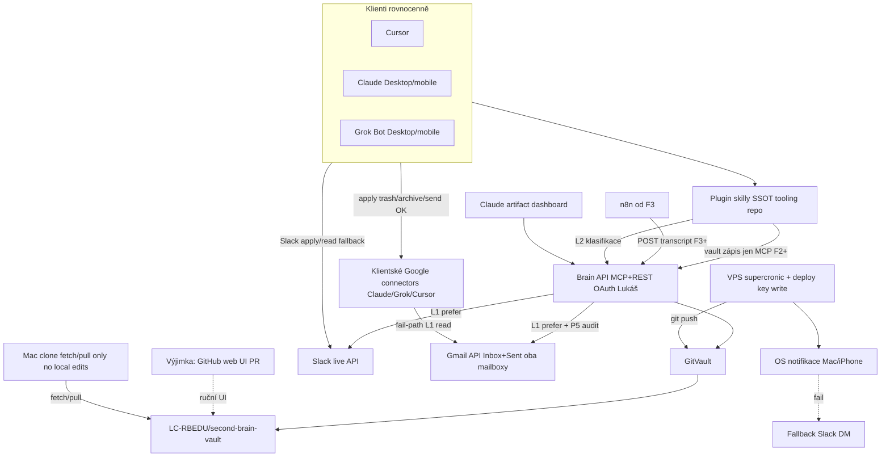

# Plán: F0 — Cílová architektura nového operačního modelu SB

> Architekt: **k=2 · r=3** (po kritik NEW-1…3: A29 sync budget SSOT + P5 Inbox/Sent + sync-architecture path)  
> **Stav: SCHVÁLENO** — kritik c1075c30… + uživatel B1–B22 (2026-10-10). Pipeline **DONE**.  
> Pipeline ledger: [2026-10-10-sb-operacni-model-f0.pipeline.md](2026-10-10-sb-operacni-model-f0.pipeline.md)  
> Vault: **SB15 — Nový operační model SB — multi-klient, Grok orchestrace, GitHub vault** (**SB15-1** hotovo)  
> Analýza: `OBSIDIAN/02-PROJEKTY/second-brain/materials/2026-10-10 — Analýza nového operačního modelu SB.md`  
> Schválená kopie: `OBSIDIAN/02-PROJEKTY/second-brain/materials/2026-10-10 — F0 cílová architektura operačního modelu SB.md`  
> Profil: **SECOND_BRAIN**. F0 = jen dokument (žádný kód/deploy).

## Zadání a požadavky

R1 — F0 = jen dokument: cílová architektura + rozpad F1–F5; každá další fáze = vlastní pipeline. (rozhodnutí z konverzace; kotva **SB15**)

R2 — Hlavní vstup rovnocenně Claude, Grok, Cursor. Vůči Brain API klienti rovnocenní; Saturnin (F5) **není** povinná brána. (analýza + grill Q15a)

R3 — Grok styl: subagentí, proaktivita, computer use, paměť, mobil. Computer use = **jen** Claude/Grok Desktop; Brain API **bez** UI automace. (analýza + grill Q14a)

R4 — Autonomie: vault zapisovat sami; navenek (Slack, e-mail) jen se schválením. (analýza)

R5 — Push: **primárně nativní OS notifikace** Mac + iPhone (přes Claude/Grok app notification API z VPS). **Slack DM = fallback**. Primár **není** zpráva v chatu bota. (grill Q4c + Q10a)

R6 — Data: netrénovat; ne rizikové dodavatele; Workspace + Claude Team + VPS + GitHub OK. Rozpočet ≤ 50 USD/měsíc **nad** provozní base: Claude Ultra + Claude Team + **Cursor licence (vč. Grok/tooling v rámci Cursor)** + **standalone Grok Bot** Desktop/Mobile (A29) — tyto base mimo strop (Q1a + Q16 + A29). Do ≤50 jen **nové usage-based / navýšení kvůli SB**. Computer-use = součást Ultra Desktop, ne položka ≤50. Údržba hybrid. (analýza + grill Q1a + Q16 + Šťoural g=5)

R7 — Vault SSOT = privátní GitHub `LC-RBEDU/second-brain-vault`; Drive opustit jako SSOT. Systém nesmí záviset na Obsidianu. (analýza + grill Q7)

R8 — Zachovat: projekty jako úložiště, `.md`, flat i epic→story→task. (zadání uživatele)

R9 — Přílohy: `materials/` + sidecar; binárky v gitu vedle materiálů. **Ne** `files/`. Drive jen Google-native / sdílené / nad limitem. LFS práh F0 **nezamyká** — F1 gate (grill Q3b + Q13b).

R10 — YAML frontmatter zachovat; wikilinky ve FM → ID/slugy; `aliases` pryč. (analýza)

R11 — Triáž živě ze zdrojů s ověřením stavu; `01-INBOX` jen vlastní poznámky + Sembly. Slack/email **ne** jako SSOT fronta v gitu. (analýza + C4)

R12b — **Gmail mailbox assist (F3+):** assist nad **celým Inboxem** obou účtů (Workspace + osobní) **+ Sent** pro kontext threadů / odchozích; F3 MVP **ne** All Mail, **ne** Spam (Q19a). Akce: (i) trash/junk, (ii) archive bez nutné reakce, (iii) připravit / odeslat reakce kde potřeba — vždy batch návrh + schválení (Q17c). L1 discovery preferovaně Brain tools (P5 enforce + audit); apply Brain **nebo** klientský Google connector. Hvězdička / „míček“ / labels = **hinty**, nevyřazují z fronty. (C4 + Q17c + Q19a; nahrazuje Q11d)

R12 — Slack signály: DM/GDM, @zmínky, vlákna kam uživatel psal, emoji `:eyes:` / `:gear:`. Ne Saved/To-dos/Remind me. Ne oslovení jménem bez tagu. (analýza)

R13 — Sembly automat: n8n → brain → sembly → skill **až od F3**. F1–F2: n8n INBOX **všechny** vypnuté (vč. mobile-capture); Sembly/mobile manuálně/chat. (Q5b + Q12a)

R14 — Deterministická logika = lifecycle crony na VPS, ne LLM rutiny. (analýza)

R15 — Dashboard = Claude artifact přes brain API; fail-path MCP App / chat `get_context` / Slack brief; ne VPS web. (grill Q6a)

R16 — Skilly: jeden SSOT v tooling repu → plugin do Cursor / Grok / Claude. (analýza)

R17 — Boti ladit až F5; dnes Saturnin + specialisti. (analýza)

R18 — Proaktivita: (1) ráno (2) deadline/Waiting (3) před schůzkou (4) anomálie (5) večerní triáž. NE immediate. Dorucení: OS notifikace → Slack DM fallback. (Q10a)

R19 — VPS zachovat jako jádro (MCP + crony). (analýza)

R20 — Týmové task listy mimo SB; sync skill později. (analýza)

R21 — F0 REVIEW/QA/Tester přeskočeny (jen dokument). (rozhodnutí)

R23 — Po F2 tvrdé API-only: klienti zapisují **vault** jen přes Brain API (MCP). Default bez filesystem/git commit. (grill Q2a) — netýká se Gmail/Slack connectorů pro mailbox apply (Q17c).

R25 — **Writers vaultu:** jediný automatický writer = VPS (deploy key → git push). **Lokální Mac klon = fetch/pull only** — žádný `git push` z Macu (ani CLI/`gh`/API push). F1: **žádné lokální edity** vault klonu (vč. computer-use zápisu do souborů). Výjimka zápisu mimo VPS = **GitHub web UI PR** (ručně v prohlížeči). Klientský vault write až F2 přes MCP. (Q9b + C3 + A24; uzavřeno A28)

R24 — Před F1 writer cutover: vypnout Obsidian Sync + Drive Desktop jako writer. Po F4 volitelný read-only klon (fetch/pull). (grill Q8 + C3)

R22 — Plán musí obsahovat: cílovou architekturu, mapu čtenářů/zapisovatelů + pořadí migrace, rozpad F1–F5, rizika ověření, B# dokumentační, T# checklist dokumentu. (brief F0)

R26 — F1–F2: stale Slack INBOX (zodpovězené vlákna v dumpnutých MD) **akceptováno** do F3 živé triáže; explicitní riziko + B14. (C8; uzavřeno A28)

R27 — **Gmail hybrid (Q17c):** L1 prefer Brain (`get_triage_candidates` / ekvivalent) s P5 server-side; apply trash/archive/send smí Brain **nebo** klientský Google connector (Claude/Grok interní pluginy se nespolehlivě nezakážou — akceptováno). Hard: (1) žádné tiché trash/archive/send — vždy batch + schválení ve stejném klientovi; (2) všichni klienti umí načíst **inbox + sent** obou mailboxů. Fail-path Brain L1 down → client connector list; P5 pak jen skill convention (riziko).

Mimo rozsah F0: implementace kódu, migrace vaultu, deploy, změna botů, změna n8n; detail implementace F1–F5.

Netýká se (profil SECOND_BRAIN): Alembic, RBAC, frontend subnav, `qa_gate.mjs`, Playwright-T6, Celery.

---

## Předpoklady

A1 — Vault = **`LC-RBEDU/second-brain-vault`** (private, Q7). Ne un-ignore `OBSIDIAN/` v tooling. Tooling = `LC-RBEDU/second-brain`.

A2 — Brain API = nová HTTPS služba na Coolify; remote MCP + tenké REST pro n8n a Claude artifact. Dnes v `vps/second-brain-hub` žádný brain/MCP server není.

A3 — Po F2: zapisovatelé **vaultu** = Brain API + VPS crony přes `GitVault` (deploy key). Klienti vault **jen MCP**. Dev-bypass default **neexistuje**.

A3b — **F1:** klientský vault writer = žádný. Automatický writer = VPS cron (deploy key). Výjimka = GitHub **web UI** PR. Mac clone = **fetch/pull only** (C3 / R25 / A24).

A4 — Plán `2026-10-04-agent-guide-mimo-cursor` je přechodný most, ne cíl.

A5 — `2026-10-06-rozhrani-nastroju` (Wiki vs Drive) je ortogonální; F0 ho neřeší.

A6 — Strop ≤ 50 USD = **jen nové usage-based / navýšení kvůli SB** nad provozní base. Mimo strop (base): Claude Ultra + Claude Team + **Cursor licence včetně Grok/tooling v rámci Cursor** + **standalone Grok Bot** (A29) + computer-use v Ultra Desktop (Q1a + Q16). VPS/Coolify/GitHub private = existující náklady mimo ≤50.

A7 — Objem vaultu (2026-10-10): **782 MB**, **7432 souborů**; non-`.md` ~731 MB → F1 LFS/Drive gate před importem.

A8 — Claude routines MCP bug a Grok private plugin = gate před F2; F0 má checklist + fail-path.

A9 — VPS web dashboard **ne**. Dashboard = Claude artifact; fail-path MCP App / chat / Slack brief (Q6a).

A10 — F1 bez Drive→git bridge. n8n INBOX writers **všechny** vypnout (Q5b + Q12a).

A11 — Primární push = nativní OS notifikace Mac+iPhone. Gate F3; fail Slack DM (Q10a).

A12 — Přílohy: `materials/` + sidecar (Q3b). Nikde `files/`.

A13 — Saturnin v F5 laditelný, ale ne povinná brána (Q15a).

A14 — F1 capture freeze: lidský zápis = GitHub **web UI** PR (ne `gh`/API push z Macu); chat→vault až F2 MCP. (A24)

A15 — 5 triggerů v R18/B12; NE immediate.

A16 — Boti (B13): Saturnin, Second Brain, Inbox Manager, Správce kalendáře, Správce Wiki, Vládce RB Universe, Admin asistent, Právník, New Bot.

A17 — Externí / mailbox mutace (R4, R27): **batch návrh + schválení ve stejném klientovi** jako propose (trash / archive / send). Žádné tiché mazání ani tichý send. (Q17c hard)

A18 — Paměť SSOT = vault; žádná paralelní klientská paměť jako SSOT.

A19 — Auth: Google OAuth = IdP; klient→Brain user-bound OAuth. Scopes = F2 (vault) + F3 Gmail scopes (inbox+sent read; mutate po schválení).

A20 — **Base vs strop:** Claude Ultra (vč. CU), Claude Team, **Cursor licence + Grok/tooling v rámci Cursor**, **standalone Grok Bot** (A29) **nemohou** protrhnout ≤50 — do stropu nepatří (Q1a + Q16 + A29). Riziko rozpočtu = jen nové usage-based / navýšení kvůli SB (Riziko 12).

A21 — F4 „stop n8n Drive“ = neobnovovat Drive writers; F1 už vypnul.

A22 — Gmail Q11d (star∨míček) **superseded** C4 → R12b; scope upřesněn Q19a (Inbox+Sent, ne All Mail/Spam).

A23 — F1–F2 stale Slack dump = akceptované riziko do F3 (C8 / R26); mitigace = večerní triáž s vědomím zastaralosti + F3 live API.

A24 — **F1 zákaz lokálních editů** vault klonu včetně computer-use zápisu do souborů; lidský zápis jen GitHub **web UI** PR (ne `gh`/API push z Macu). (grill g=4)

A25 — **Gmail scope F3 MVP** = Inbox + Sent, oba mailboxy; ne All Mail, ne Spam. (Q19a)

A26 — **Session** = 1 invocace triage skillu / ekvivalent Brain `get_triage_candidates`; overflow → další invocace; řazení Date ASC; hinty nevyřazují. (Q18a)

A27 — **Batch approve** mailbox akcí je hard requirement napříč Cursor/Claude/Grok (A17 + Q17c).

A28 — R25 (Mac pull-only / VPS write / web UI PR) a R26 (stale Slack F1–F2) uzavřené; další grill je neotevírá bez nové user změny.

A29 — Standalone **Grok Bot** Desktop/Mobile (mimo „Grok/tooling v rámci Cursor“) = provozní base **mimo ≤50**, stejně jako Ultra / Team / Cursor. Do stropu jen nové SB-specific usage-based / navýšení. (Šťoural g=5; doplněk Q16)

A30 — **Sent** = jen kontext threadů / odchozích; akční L2 kandidáti (trash / archive / needs_reply) = **Inbox**. Sent smí být v L1 metadata listu (P5), ne jako samostatná fronta ke smazání. (Šťoural g=5)

---

## Současný stav (ověřeno v kódu)

| Fakt | Důkaz |
|---|---|
| Drive = SSOT vaultu; hub stateless přes Drive API | `vps/second-brain-hub/README.md`; `vps/second-brain-hub/docs/sync-architecture.md` |
| `OBSIDIAN/` git-ignored | `.gitignore` L11 |
| CAS zápis `expect_mtime` / `DriveConflictError` | `lib/drive_io.py` (~L139–577) `DriveVault.write_bytes` |
| Lifecycle stagger 2h; agent-context `*/15 7-22`; slack_poll `*/2 8-23` | `deploy/crontab` L16–65 |
| `inbox_inventory` **Po–Pá 6:55** (`55 6 * * 1-5`); komentář chybně „Po 6:55“ | `deploy/crontab` L40–41 |
| Triáž cron LLM zrušen 2026-09-24; chat-only | crontab L39; skill `agenda-triage` |
| `slack_poll` discover: `to_me`, `from_me`, `mention`, `hasmy::gear:` — **ne** `is:saved`, **ne** `:eyes:` | `cron/slack_poll.py` `_discover_queries` L70–77 |
| Crontab komentář zmiňuje `is:saved` — **drift** vs kód | crontab L62 vs `_discover_queries` |
| Archiv Done: default `keep-days=0` | `archive_done_tasks.py` L10, L38–41 |
| Lokální snapshot: `scripts/build_agent_context.py` | skript |
| VPS snapshot: `cron/build_agent_context.py` přes DriveVault | cron |
| Skills install = symlink **Cursor only** | `scripts/install_agenda_skills.sh` L1–22 |
| n8n Sembly / Gmail starred / sent → Drive `01-INBOX/` | `ŠABLONY/n8n/README.md` L22–27 |
| Write policy (ne I/O): `agent_write_guard` | `scripts/lib/agent_write_guard.py` |
| FM šablony: `project: "[[…]]"`, `aliases: [ID]` | `ŠABLONY/obsidian-templates/task-template.md` L5–7 |
| Brain API / remote MCP v hubu **neexistuje** | žádný FastAPI/MCP pod `vps/second-brain-hub` |
| Dnešní Gmail capture = **starred** (+ sent dump), ne full Inbox assist | n8n README `gmail-starred-to-inbox-*` |

### Mapa čtenářů a zapisovatelů (dnes)

**Zapisovatelé vaultu:**

| # | Actor | Co píše | Mechanismus |
|---|---|---|---|
| W1 | Lifecycle crony | task FM/body, archiv, hub `## Stav (auto)` | DriveVault + CAS |
| W2 | `build_agent_context` (VPS) | `agent-context*.json`, `charters.json` | DriveVault |
| W3 | `build_sources_routing` | routing JSON | DriveVault |
| W4 | `slack_poll` | `01-INBOX/slack/*_vN.md`, state, přílohy | DriveVault + CAS |
| W5 | `reminders_dispatch` | `Reminders-Pending/` | DriveVault |
| W6 | weekly / calendar / EDU marker | drafty / JSON / marker | DriveVault |
| W7 | n8n (gmail-*, sembly, mobile-capture, …) | `01-INBOX/**` | Google Drive node |
| W8 | Cursor / lokální skripty | tasks, materials, archive | filesystem `OBSIDIAN/` (Drive Desktop) |
| W9 | Claude Cowork / Grok | omezeně dle návodu + guard | filesystem / remote folder |
| W10 | Obsidian Sync + ruční edit | libovolné MD | Sync → Mac → Drive |

**Čtenáři:**

| # | Actor | Co čte |
|---|---|---|
| R-a | `build_agent_context` (local+VPS) | hubs, tasks, archive, lessons, areas |
| R-b | lifecycle / inbox_inventory / slack_poll | tasks, INBOX, state |
| R-c | Skills `agenda-*` (Cursor) | vault + snapshot |
| R-d | Obsidian Bases (málo) | frontmatter live |
| R-e | Claude/Grok s folderem | subset vaultu |
| R-f | n8n | externí API → zápis Drive |

### Pořadí migrace (čtenáři dřív než data) — lineární 1…10

1. **Preflight (R24):** vypnout Obsidian Sync + Drive Desktop jako writer.  
2. **Začátek F1:** vypnout n8n INBOX writers — žádný Drive→git bridge (A10). Sembly/Gmail/mobile automat pauza do F3.  
3. `GitVault` + clone `LC-RBEDU/second-brain-vault` na VPS (deploy key = **write**); read path cronů (feature flag).  
4. Lokální Mac: git clone **fetch/pull only** (žádné push credentials; žádný `git push` / `gh` / API); **žádné lokální edity** klonu (A24); skills čtou klon, ne Drive mirror jako SSOT.  
5. `build_agent_context` → git; klienti na git snapshot (read).  
6. **Writers cutover:** lifecycle/crony → git přes VPS. Výjimka zápisu mimo VPS = **GitHub web UI PR**.  
7. **F2:** Brain API; klienti vault write jen MCP.  
8. **F3:** n8n→brain; živá triáž Slack + **Gmail hybrid Inbox+Sent assist** (R12b/R27); OS notifikace + Slack fallback.  
9. **F4:** stop `slack_poll` dump; Drive jen R9 výjimky; volitelný Obsidian read-only klon (pull-only).  
10. Frontmatter migrace (R10) až když čtenáři umí ID/slug.

---

## Návrh

### Cílová architektura

Vrstvy:

1. **Vault repo** — PARA + `02-PROJEKTY/<slug>/{tasks,materials}/`, `01-INBOX/{daily,sembly}/`, `00-System/`, `07-ARCHIV/`. Bez runtime závislosti na Obsidian Bases.  
2. **Tooling repo** — hub, scripts, skills, plány.  
3. **GitVault** — náhrada `DriveVault`: path API, CAS (`expect_oid`), commit konvence, lock, idempotentní cron. **Push jen z VPS** (deploy key).  
4. **Brain API** — `get_context`, task ops, `capture_daily`, `ingest_sembly`, `get_triage_candidates` (L1 prefer + P5), `propose_external_send` / propose mailbox mutate (bez apply bez schválení).  
5. **Plugin** — SSOT `ŠABLONY/skills` → Cursor / Claude / Grok.  
6. **Crony** — stejná lifecycle sada; I/O GitVault; `focus` nikdy cronem.  
7. **Živá triáž** — Slack live; Gmail hybrid níže; ne `01-INBOX/slack|email` jako SSOT.  
8. **Dashboard** — Claude artifact → brain.  
9. **Proaktivita** — VPS detektory → OS push; fail Slack DM.

### Gmail mailbox assist (F3+) — hybrid L1 / L2 / apply (R12b / R27 / Q17c)

Oba mailboxy: `lukas@redbuttonedu.cz` + `lukas.cypra@gmail.com`. Scope MVP: **Inbox + Sent** (A25); ne All Mail, ne Spam.

| Vrstva | Preferovaná cesta | Alternativa / fail-path | Co | Hard constraints |
|---|---|---|---|---|
| **L1 Discovery** | Brain tools → Gmail API (`get_triage_candidates`); P5 enforce + audit na serveru | Brain down → client Google connector list; **P5 jen skill convention** (Riziko 16) | List Inbox (+ Sent pro thread/odchozí kontext); metadata first; Date ASC; hinty nevyřazují; session = 1 invocace (A26) | Dump do gitu ne; discovery ≠ jen starred |
| **L2 Klasifikace** | LLM ve skillu přes Brain kandidáty | stejný skill nad client L1 listem | (i) trash/junk (ii) archive_no_reply (iii) needs_reply → draft | Návrh vždy batch (A27) |
| **Apply** | Brain Gmail mutate **nebo** klientský Google connector (akceptováno) | — | trash / archive / send po schválení | **Žádné tiché** trash/archive/send; schválení ve stejném klientovi (A17) |

Hard requirement napříč Cursor/Claude/Grok: každý klient umí **načíst správné příchozí i odchozí** (Inbox + Sent, oba mailboxy) — přes Brain L1 nebo vlastní connector.

Dnešní n8n starred→INBOX: vypnuté F1–F2; v F3 **není** cílový model.

### F0 výstup

| Soubor | Co | R# |
|---|---|---|
| `docs/plans/2026-10-10-sb-operacni-model-f0.md` | tento plán | R1, R22 |
| ledger `.pipeline.md` | stav pipeline | R1 |
| SB15 + materiál analýzy | po schválení F0 odškrtnout **SB15-1** | R1 |

F0 **nemění** `vps/`, n8n, boty, vault data.

### Rozpad F1–F5

#### F1 — Vault → GitHub; crony Drive → git

| | |
|---|---|
| **Vstupy** | F0 schváleno; vault repo; A7; VPS deploy key (write); Sync/Drive writer off; n8n INBOX all off; LFS gate |
| **Výstupy** | Vault v gitu; `GitVault`; crony přes git; runbook: Mac = fetch/pull only + **no local edits** (A24); runbook výpadku Sembly/Gmail/mobile; **stale Slack INBOX do F3 akceptováno** (R26) |
| **Závislosti** | žádná Brain API; klienti vault read-only; žádný Mac push ani CU zápis do klonu |
| **Migrace** | kroky 1–6 |
| **R#** | R7, R8, R14, R19, R25, R26 |

#### F2 — Brain API + skilly plugin

| | |
|---|---|
| **Vstupy** | F1 git SSOT; smoke Grok private plugin + OAuth; Privacy Mode |
| **Výstupy** | Brain API; klienti vault MCP write; plugin SSOT; serverová policy; FM kontrakt ID/slug |
| **Fail-path** | Grok plugin fail → Claude+Cursor first |
| **R#** | R2–R6, R10, R16, R19, R23 |

#### F3 — Slack / Sembly / živá triáž / Gmail hybrid / briefy

| | |
|---|---|
| **Vstupy** | F2 API; Slack user token; Gmail OAuth Inbox+Sent oba mailboxy; n8n Sembly → brain |
| **Výstupy** | `ingest_sembly`; Slack live + eyes/gear; **Gmail hybrid L1/L2/apply** (R27); batch approve UX; OS notifikace gate (fail Slack DM) |
| **Závislosti** | F2; `slack_poll` paralelní do F4 parity |
| **R#** | R11–R13, R12b, R27, R18, R5, R4 |

#### F4 — Úklid Obsidian/Drive/poll + artifact

| | |
|---|---|
| **Vstupy** | F3 parity |
| **Výstupy** | Stop `slack_poll` dump; Drive jen R9; Obsidian nepovinný pull-only; Claude artifact; sync-architecture docs |
| **R#** | R7, R9, R15, R24 |

#### F5 — Revize botů

| | |
|---|---|
| **Vstupy** | Stabilní F2–F4 |
| **Výstupy** | Saturnin + specialisti na brain tools; úklid New Bot / případné sloučení |
| **R#** | R3, R17 |

### Odchylky od analýzy / předchozích plánů

| Analýza / starší rozhodnutí | Plán | Proč |
|---|---|---|
| Přílohy v `files/` | `materials/` + sidecar | Q3b |
| Push tři kanály rovnocenně | OS notifikace primár, Slack fallback | Q4c+Q10a |
| Sembly hned | Automat až F3; F1–F2 n8n off | Q5b |
| Gmail star∨míček (Q11d) | Inbox+Sent assist L1/L2 hybrid | C4 + Q17c + Q19a |
| Gmail jen přes Brain (Šťoural a) | **Hybrid Q17c** — L1 prefer Brain; apply Brain\|client | odchylka uživatele |
| Slack vč. `:eyes:` hned | F3; dnes jen `:gear:` | `slack_poll._discover_queries` |
| Crontab „is:saved“ / „90 dní archiv“ | Saved ne; archiv `keep-days=0` | kód > docs |
| Multi-klient návod+guard | Ne cíl; F2 vault API-only | Q2a |
| Lokální git push / edit jako writer | **Zakázán**; VPS + web UI PR; no CU file write F1 | C3 + A24 |
| ≤50 jen nad Ultra/Team | + Cursor licence / Grok v Cursor + standalone Grok Bot mimo strop | Q16 + A29 |

### Checklist A (chování) — SECOND_BRAIN / F0

- CAS / jediný automatický vault zapisovatel — F1+ (GitVault + VPS; Mac bez push/edit).  
- Idempotence cronu — zachovat.  
- Konvence vaultu — zachovat model; změnit transport SSOT a FM odkazy.  
- `focus` jen člověk — zachovat.  
- Externí / mailbox mutate jen se schválením — R4 + R27 + A17.  
- RBAC / Alembic / subnav — **netýká se**.

---

## Kontrakt chování (B#)

F0 = dokumentační. „Výsledek“ = schválený text v tomto souboru.

| B# | Vstup / stav | Očekávaný výsledek | R# | Test T# |
|---|---|---|---|---|
| B1 | Čtenář otevře F0 | Cílová architektura: vault repo, Brain API, GitVault, VPS write / Mac pull-only no-edit, plugin, 3 klienti, Slack/Gmail hybrid, živá triáž, artifact | R1,R2,R7,R11–R16,R19,R22,R25,R27 | T1 |
| B2 | Mapa I/O | W1–W10 + R-a–R-f + migrace **1…10 lineárně** | R22 | T2 |
| B3 | F1–F5 | vstupy/výstupy/závislosti; bez času; vlastní pipeline | R1 | T3 |
| B4 | SSOT | privátní GitHub vault; Drive ne SSOT; Obsidian ne runtime | R7 | T1 |
| B5 | Autonomie / vault zápis | F1: VPS cron (+ web UI PR); Mac fetch/pull + no local edits; F2+: vault jen MCP; mailbox apply viz B7b | R4,R23,R25,A24 | T1 |
| B6 | INBOX budoucnost | Jen `daily` + `sembly`; slack/email ne SSOT | R11 | T1 |
| B7b | Gmail assist | Inbox+Sent oba mailboxy (ne All Mail/Spam); L1 prefer Brain + P5 audit; fail-path client list; L2 trash/archive/needs_reply **jen Inbox** (Sent = kontext, A30); apply Brain\|client po **batch schválení**; všichni klienti čtou inbox+sent; žádný dump do gitu | R12b,R27,A25–A27,A30 | T1 |
| B7 | Slack signály | DM/GDM, @mention, vlastní vlákna, eyes/gear; NE Saved/To-dos/Remind/jméno bez tagu | R12 | T1 |
| B8 | Sembly | n8n→brain→skill až F3; F1–F2 manuál / n8n off | R13 | T1 |
| B9 | Lifecycle | Cron VPS, ne LLM rutiny | R14 | T1 |
| B10 | Dashboard | Claude artifact + brain; ne povinný VPS web | R15 | T1 |
| B11 | Skilly | Jeden SSOT → plugin 3 klientů | R16 | T1 |
| B12 | Proaktivita + push | 5 triggerů; NE immediate; OS notifikace primár; Slack fallback | R5,R18,A15 | T1 |
| B13 | Boti | F5; seznam A16; Saturnin ≠ povinná brána | R17,R2,A16 | T1 |
| B14 | Rizika | Grok plugin; OAuth; Claude routines; git; Privacy; OS push; artifact; výpadek Sembly/Gmail/mobile F1–F2; stale Slack F1–F2; LFS; rozpočet (base mimo strop vč. Cursor/Grok); **P5 soft na client L1 path**; Mac edit/CU write | R6,R15,R22,R26,R27 | T4 |
| B15 | FM / přílohy | YAML ano; ID/slug; aliases pryč; materials/+sidecar | R9,R10 | T1 |
| B16 | Model | projekty, md, flat+hierarchy | R8 | T1 |
| B17 | Mimo rozsah F0 | žádný diff kódu/deploy/n8n z F0 | R1,R21 | T5 |
| B18 | Vazba SB15 | odkaz SB15 + materiál | R1 | T1 |
| B19 | Odchylky | tabulka s důkazem z kódu | R22 | T2 |
| B20 | Budget / data | ≤50 = jen nové usage-based / navýšení SB; **mimo strop:** Ultra+Team+CU + Cursor licence + Grok/tooling v Cursor + standalone Grok Bot (A29); no-train | R6,A6,A20,A29,Q16 | T1 |
| B21 | Writer cutover preflight | Sync/Drive writer off; n8n INBOX all off; klienti vault read-only; Mac fetch/pull only; **žádné lokální edity ani CU zápis do klonu**; write = VPS deploy key (+ GitHub **web UI** PR, ne gh/API z Macu) | R24,R25,A10,A24 | T1, T2 |
| B22 | Computer use | Jen Claude/Grok Desktop; Brain API bez UI automace; F1 CU **nesmí** zapisovat vault soubory | R3,A24 | T1 |

Checklist A body nerelevantní pro F0 docs: SQL/RBAC/migrace Alembic — netýká se. CAS/idempotence/focus/external-send — pokryto B5/B9/B7b.

---

## Výkonový rozpočet (P)

F0 nenasazuje endpointy. P = **závazné stropy pro F1–F3 plány**.

| Tělo | Rozpočet |
|---|---|
| P1 `get_context` / artifact | cold ≤ 2 s, warm ≤ 500 ms; 1× `agent-context.json` (+ volitelně 1× refresh pokud `generated_at` > 15 min); payload ≤ 256 KB light |
| P2 `create_task` / `update_task` | ≤ 1 git commit; lock wait ≤ 5 s; CAS retry ≤ 3; žádný full-repo scan; push jen VPS |
| P3 lifecycle cron tick | stagger jako dnes; GitVault: 1 fetch + N file ops + 1 push max; konflikt → skip+log |
| P4 `build_agent_context` | < 30 s VPS při A7; lokálně typicky < 5 s |
| P5 živá triáž — **Slack + Gmail** | **Slack:** search ≤ stávající poll budget; žádné dumpování celých kanálů do gitu. **Gmail (oba mailboxy):** L1 **Inbox** metadata ≤ **100 / mailbox / session** (Date ASC; hinty nevyřazují); **Sent** = jen thread-join ke kandidátům z Inbox (bez samostatného Sent listu / bez druhého stropu, A30); full body fetch ≤ **40 / session** celkem napříč mailboxy; žádný sync celého mailboxu do gitu; L2 LLM jen nad Inbox L1 kandidáty; timeout list cold ≤ 3 s / mailbox, warm ≤ 1 s. **Session (Q18a):** 1 session = 1 invocace triage skillu / `get_triage_candidates`; overflow → další invocace. **Enforce:** P5 tvrdě na Brain L1 (+ audit); na client fail-path L1 jen skill convention (Riziko 16). |
| P6 Sembly ingest (F3+) | 1 commit / transcript; binárky materials/+sidecar; LFS/Drive dle F1 gate |
| P7 Cache | `agent-context.json` TTL align 15 min; invalidace po Brain write |
| P8 SQL | netýká se |
| P9 Payload binárek | běžné v gitu; > limit → Drive (R9) |
| P10 Idempotence | stejný Sembly webhook 2× → 1 soubor |
| P11 Mobil / push | brief ≤ Slack DM limit; detail deep link artifact/API |

---

## Testy (T#)

| T# | Typ | Owner | Soubor | Co ověřuje (B#) |
|---|---|---|---|---|
| T1 | ruční checklist dokumentu | gate (hlavní + uživatel) | tento soubor | B1, B4–B13, B15, B16, B18, B20, **B21, B22**, B7b hybrid |
| T2 | ruční checklist | gate | mapa 1…10 + odchylky + preflight writers | B2, B19, **B21** |
| T3 | ruční checklist | gate | F1–F5 | B3 |
| T4 | ruční checklist | gate | Rizika (stale Slack, rozpočet base vč. Cursor/Grok, P5 soft client) | B14 |
| T5 | ruční / git status | gate | žádný diff `vps/**` `ŠABLONY/n8n/**` z F0 | B17 |
| T6 | netýká se | — | pytest/deploy | F0 nenasazuje (R21) |

Schválení uživatele po SCHVÁLENO kritika: **B1–B22**.

TESTER: přeskočeno (profil SECOND_BRAIN + F0 docs).

---

## Pořadí implementace

F0-a — Zapsat tento plán + ledger.  
F0-b — Šťoural + kritik; uživatel schválí **B1–B22**.  
F0-c — Po schválení: odškrtnout **SB15-1 — F0 cílová architektura**.  
F0-d — A7 objem jako vstup F1 (hotovo).  
F0-e — Gate T4 položek bez kódu (Privacy, Grok plugin smoke) — před F2; paralelně s F1 OK.

Pak samostatné pipeline: F1 → F2 → F3 → F4 → F5.

---

## Rizika a zpětná kompatibilita

1. **Grok Bot + plugin ze soukromého GitHubu** — smoke před F2; fail-path: Grok bez pluginu / odklad zápisů.  
2. **OAuth pro Grok MCP** — veřejné HTTPS; secret header ne; fail-path API key jen Cursor/Claude.  
3. **Claude routines / MCP bug** — proaktivita na VPS + app push; ne jen Claude routine.  
3b. **App push gate** — ověřit Claude/Grok app; fail Slack DM (nesmí se stát tichým primárem).  
3c. **Výpadek Sembly/Gmail/mobile INBOX F1–F2** — záměr Q5b/Q12a; manuál + F3.  
4. **Git konflikty / dual-writer** — lock + CAS + migrace 1…10; Mac bez push/edit snižuje dual-writer riziko.  
5. **Privacy Mode / no-train** — ověřit Cursor + Grok + Claude Team.  
6. **LFS / velikost** — 782 MB; F1 gate před importem.  
7. **n8n downtime při Sembly přepojení** — F3 maintenance window.  
8. **Ztráta `slack_poll` watchlist** — export state JSON před F4.  
9. **FM migrace vs Obsidian wikilinky** — akceptováno (R7); čtenáři dřív.  
10. **2026-10-04 guard návod** — po F2 superseded.  
11. **Coolify push main = ostrý vault** — dry-run + feature flag.  
12. **Rozpočet ≤50** — strop jen pro **nové usage-based / navýšení kvůli SB**. **Mimo strop:** Claude Ultra (vč. CU), Claude Team, **Cursor licence + Grok/tooling v rámci Cursor**, **standalone Grok Bot** (Q1a + Q16 + A29 / A20). Gate F1+: seznam nových nákladů před nákupem.  
13. **Stale Slack INBOX F1–F2** — dump může obsahovat už vyřešená vlákna; **akceptováno** do F3 (R26 / C8).  
14. **Gmail Inbox+Sent volume** — L1/L2 bez P5 stropů spálí tokeny/kvóty; P5 závazné na Brain path.  
15. **Mac write / lokální edit / CU zápis** — runbook F1: deploy key jen VPS; lokálně žádný push URL; zákaz editů klonu včetně computer-use; lidský zápis jen GitHub **web UI** PR (ne `gh`/API). (A24)  
16. **P5 soft na client L1 path** — při fail-path Brain L1 → client connector list není server-auditovatelný stejně jako Brain; P5 jen skill convention. Akceptováno Q17c; F3 má měřit frekvenci fail-path.  
17. **Klientské Google pluginy apply** — Claude/Grok interní connectors se nespolehlivě nezakážou; mitigace = povinný batch approve UX (A17/A27), ne technický ban connectorů.

---

## Otevřené otázky pro uživatele

Uzavřeno grill 1+2+4 + C3/C4/C8 — žádné blokující otevřené.

| Q / C | Rozhodnutí | Kam |
|---|---|---|
| Q1a | Ultra/Team mimo strop; CU v Ultra mimo ≤50 | A6, A20, R6, B20, Riziko 12 |
| Q16 + A29 | Cursor licence + Grok v Cursor + standalone Grok Bot = base mimo ≤50; do stropu jen nové usage-based / navýšení SB | A6, A20, A29, R6, B20, Riziko 12 |
| Q2a | Vault API-only po F2 | A3, R23, B5 |
| Q3b | materials/+sidecar | A12, R9, B15, P6 |
| Q4c+Q10a | OS notifikace primár; Slack fallback | A11, R5, R18, B12, B14 |
| Q5b | n8n off F1; Sembly auto F3 | A10, R13, F1, B8 |
| Q6a | Artifact + fail-path | A9, R15, B10 |
| Q7 | `LC-RBEDU/second-brain-vault` | A1, R7, B4 |
| Q8 | Sync/Drive writer off před F1 | R24, B21 |
| Q9b+C3 | F1 read-only; VPS write; Mac fetch/pull; web UI PR | A3b, R25, B5, B21, A28 |
| Q11d→C4 | Gmail assist (ne jen star∨míček) | R12b, A22 |
| Q17c | Hybrid L1 Brain prefer; apply Brain\|client; batch approve hard; inbox+sent všichni klienti | R27, B7b, mermaid, Riziko 16–17, A27 |
| Q18a | Session = 1 invocace; overflow → další; Date ASC; hinty nevyřazují | A26, P5 |
| Q19a | Scope = Inbox+Sent oba účty; ne All Mail/Spam F3 MVP | A25, R12b, B7b |
| Q12a | Mobile-capture výpadek F1–F2 | A10, R13 |
| Q13b | LFS práh F1 | A7, R9, P6 |
| Q14a | CU jen Desktop | R3, B22 |
| Q15a | Klienti rovnocenní; Saturnin nepovinná brána | R2, R17, A13, B13 |
| C8 | Stale Slack F1–F2 OK do F3 | R26, A23, A28, B14, Riziko 13 |
| A24 | No local vault edits F1 vč. CU; jen web UI PR | R25, B21, Riziko 15 |

---

## C# / Q → jak vyřešeno

| ID | Závažnost / typ | Jak vyřešeno |
|---|---|---|
| **C1** | MAJOR | Riziko 12 + A20/B20/R6/A6: ≤50 jen nové položky; CU mimo strop (Q1a). **r=2:** Q16 Cursor/Grok v Cursor. **r=3 / NEW-1:** standalone Grok Bot (A29) ve všech budget SSOT (R6, A20, Riziko 12, Odchylky) stejně jako B20. |
| **NEW-1** | MAJOR | r=3: A29 sync do R6/A20/Riziko 12/Odchylky (viz C1). |
| **NEW-2** | MAJOR | r=3: P5 = Inbox ≤100/mailbox/session; Sent jen thread-join (bez samostatného listu); body ≤40 celkem; L2 jen Inbox. |
| **NEW-3** | MINOR | r=3: důkazní cesta → `vps/second-brain-hub/docs/sync-architecture.md`. |
| **C2** | MAJOR | F0-b / T1 / T2 pokrývají B21–B22; schválení = B1–B22. |
| **C3** | MAJOR | R25/A3b/B5/B21: Mac fetch/pull only; VPS deploy key; web UI PR. **r=2 + A24:** zákaz lokálních editů + CU zápisu; ne `gh`/API push. |
| **C4** | MAJOR | R12b/B7b: mailbox assist ne jen star∨míček. **r=2 + Q19a:** scope = Inbox+Sent, ne All Mail/Spam. |
| **C5** | MAJOR | P5 Gmail stropy. **r=2 + Q18a:** session = 1 invocace; Date ASC; hinty; Brain enforce vs client soft. |
| **C6** | MINOR | `inbox_inventory` Po–Pá 6:55 v Současném stavu. |
| **C7** | MINOR | Migrace lineárně 1…10. |
| **C8** | MINOR | R26 + A23 + A28 + B14 + Riziko 13: stale Slack F1–F2 akceptováno. |
| **Q16** | grill g=4 | A6/A20/R6/B20/Riziko 12: Cursor + Grok v Cursor = base mimo ≤50. |
| **Q17c** | grill g=4 | R27 + hybrid tabulka + mermaid + B7b + Riziko 16–17: L1 prefer Brain; apply Brain\|client; batch approve hard; inbox+sent všichni klienti; fail-path client P5 soft. |

---

*Profil: SECOND_BRAIN. F0 nenasazuje. Architekt k=2 · r=3 (po kritik NEW-1…3).*
