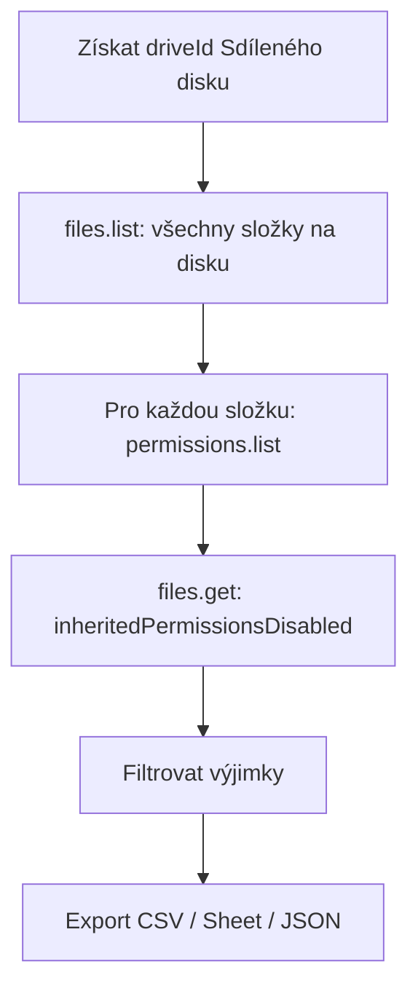

# Audit oprávnění složek na Sdíleném disku (Drive API v3)

Návod, jak přes **Google Drive API** zjistit typ sdílení a oprávnění u **složek** na vybraném Sdíleném disku. Konkrétní soubory se neřeší — audit je jen na úrovni folder tree.

## Předpoklady

| Podmínka | Proč |
|---|---|
| **Správce daného Sdíleného disku** | `files.list` vrací jen položky, ke kterým má volající účet přístup. Složky s **omezeným přístupem**, na kterých nejsi, v auditu **neuvidíš**. |
| OAuth účet s scope `https://www.googleapis.com/auth/drive` | Čtení metadat a `permissions.list`. Pro zápis oprávnění by stačil `drive.metadata.readonly`, ale prakticky se používá plný `drive`. |
| `supportsAllDrives=true` u všech volání | Bez toho Shared Drive API nefunguje správně. |

Domain admin s `useDomainAdminAccess=true` může auditovat i disky, kde není běžným členem — tohle je mimo scope běžného auditu pod správcem disku.

---

## Co audit umí zjistit

Pro každou složku na disku:

| Signál (API) | Význam v UI |
|---|---|
| `permissions[].type` + `role` + `emailAddress` / `domain` | Kdo má přístup a jakou roli |
| `permissionDetails[].inherited` | `true` = děděné shora; `false` = nastavené přímo na této složce |
| `permissionDetails[].inheritedFrom` | ID nadřazené složky nebo kořene disku, odkud se oprávnění bere |
| `permissionDetails[].permissionType` | `member` = členství na disku; `file` = extra sdílení konkrétní složky |
| `type: anyone` nebo `type: domain` | Běžný přístup: odkaz / celá doména |
| `allowFileDiscovery` | U `domain`/`anyone`: zda je položka dohledatelná ve vyhledávání |
| `inheritedPermissionsDisabled` (na file resource) | **Omezený přístup** — složka nedědí členy disku / nadřazené složky |

### Dvě vrstvy sdílení

1. **Členové Sdíleného disku** — role na kořeni disku (`organizer`, `fileOrganizer`, `writer`, `commenter`, `reader`). Dědí se dolů, pokud složka nemá omezený přístup.
2. **Sdílení konkrétní složky** — extra lidé/skupiny, běžný přístup (odkaz / doména), případně omezený přístup.

---

## Postup auditu (doporučený)



### Krok 0 — `driveId`

Seznam disků: `GET https://www.googleapis.com/drive/v3/drives?pageSize=100`

Kořen disku má stejné ID jako `driveId` (např. `0AKtO43Yt8TS4Uk9PVA`).

### Krok 1 — Seznam všech složek

```
GET https://www.googleapis.com/drive/v3/files
  ?corpora=drive
  &driveId={DRIVE_ID}
  &includeItemsFromAllDrives=true
  &supportsAllDrives=true
  &pageSize=1000
  &q=mimeType='application/vnd.google-apps.folder' and trashed=false
  &fields=nextPageToken,files(id,name,parents,webViewLink)
```

Paginace přes `nextPageToken`, dokud není prázdný.

**Poznámka:** `files.list` nevrací permissions hromadně — u každé složky je potřeba `permissions.list` (viz krok 2).

### Krok 2 — Oprávnění jedné složky

```
GET https://www.googleapis.com/drive/v3/files/{FOLDER_ID}/permissions
  ?supportsAllDrives=true
  &fields=permissions(
      id,type,role,emailAddress,domain,displayName,allowFileDiscovery,
      permissionDetails(permissionType,inherited,inheritedFrom,role)
    )
  &pageSize=100
```

U Shared Drive může být u jedné složky víc než 100 oprávnění — paginuj `nextPageToken`.

### Krok 3 — Omezený přístup

```
GET https://www.googleapis.com/drive/v3/files/{FOLDER_ID}
  ?supportsAllDrives=true
  &fields=id,name,inheritedPermissionsDisabled
```

`inheritedPermissionsDisabled: true` = složka má **omezený přístup**.

*(Pole lze sloučit do kroku 1 přidáním `inheritedPermissionsDisabled` do `fields` u `files.list` — ušetříš volání.)*

### Krok 4 — Členové disku (volitelně, jednou)

Oprávnění kořene disku = členové disku:

```
GET https://www.googleapis.com/drive/v3/files/{DRIVE_ID}/permissions
  ?supportsAllDrives=true
  &fields=permissions(id,type,role,emailAddress,domain,displayName)
```

Toto je referenční baseline — většina složek jen dědí tyto lidi.

---

## Co reportovat (výjimky)

Plný dump všech složek je obvykle k ničemu — 95 %+ jen dědí členy disku. Audit má smysl jako **seznam výjimek**:

| Flag | Kritérium |
|---|---|
| `restricted` | `inheritedPermissionsDisabled == true` |
| `direct_share` | alespoň jedno oprávnění s `permissionDetails.inherited == false` a `permissionType == file` |
| `link_anyone` | `type == anyone` |
| `link_domain` | `type == domain` |
| `extra_member` | přímé oprávnění, které není jen děděné z disku |

Pro každou výjimku exportuj minimálně:

- `folder_id`, `folder_name`, `folder_path` (složená z `parents` + strom)
- `restricted` (bool)
- `link_sharing` (`none` / `domain` / `anyone` + role)
- `direct_grants[]` — email/skupina, role, není inherited
- `inherited_from` — pro kontext u děděných řádků (volitelně)

---

## Mapování rolí

| API `role` | Sdílený disk (UI) |
|---|---|
| `organizer` | Správce |
| `fileOrganizer` | Správce obsahu |
| `writer` | Přispěvatel |
| `commenter` | Komentátor |
| `reader` | Čtenář |

U `type`:

| API `type` | Význam |
|---|---|
| `user` | konkrétní uživatel |
| `group` | Google skupina |
| `domain` | celá doména (běžný přístup) |
| `anyone` | kdokoli s odkazem |

---

## Příklad (Python, zkráceně)

Předpoklad: OAuth credentials s refresh tokenem (viz `vps/second-brain-hub/scripts/oauth_setup.py`).

```python
from google.oauth2.credentials import Credentials
from googleapiclient.discovery import build

DRIVE_ID = "0AKtO43Yt8TS4Uk9PVA"  # vybraný Sdílený disk

creds = Credentials.from_authorized_user_file("token.json", scopes=["https://www.googleapis.com/auth/drive"])
svc = build("drive", "v3", credentials=creds)

# 1) všechny složky
folders = []
page_token = None
q = "mimeType='application/vnd.google-apps.folder' and trashed=false"
while True:
    resp = svc.files().list(
        corpora="drive",
        driveId=DRIVE_ID,
        includeItemsFromAllDrives=True,
        supportsAllDrives=True,
        q=q,
        pageSize=1000,
        pageToken=page_token,
        fields="nextPageToken,files(id,name,parents,inheritedPermissionsDisabled,webViewLink)",
    ).execute()
    folders.extend(resp.get("files", []))
    page_token = resp.get("nextPageToken")
    if not page_token:
        break

# 2) permissions + klasifikace výjimek
audit_rows = []
for f in folders:
    perms = svc.permissions().list(
        fileId=f["id"],
        supportsAllDrives=True,
        fields="permissions(id,type,role,emailAddress,domain,allowFileDiscovery,"
               "permissionDetails(permissionType,inherited,inheritedFrom,role))",
        pageSize=100,
    ).execute().get("permissions", [])

    restricted = f.get("inheritedPermissionsDisabled", False)
    link = next((p for p in perms if p["type"] in ("anyone", "domain")), None)
    direct = [
        p for p in perms
        if any(d.get("inherited") is False for d in p.get("permissionDetails", [{}]))
    ]

    if restricted or link or direct:
        audit_rows.append({
            "folder_id": f["id"],
            "folder_name": f["name"],
            "restricted": restricted,
            "link_type": link["type"] if link else None,
            "link_role": link.get("role") if link else None,
            "direct_grants": [
                {
                    "who": p.get("emailAddress") or p.get("domain") or p["type"],
                    "role": p["role"],
                }
                for p in direct
            ],
            "url": f.get("webViewLink"),
        })

# audit_rows → CSV / JSON / Google Sheet
```

---

## Limity a pozor

| Téma | Detail |
|---|---|
| **Viditelnost** | Bez role správce disku audit není kompletní — omezené složky mimo tvůj přístup v seznamu chybí. |
| **Kvóty API** | `permissions.list` = 1 volání / složka. Disk se 500 složkami ≈ 500+ requestů. Respektuj rate limits, přidej backoff. |
| **Žádný bulk endpoint** | Drive API neumí „dej permissions pro celý disk“ v jednom callu. |
| **MCP (`user-google-workspace`)** | Vhodné pro ad-hoc kontrolu jedné složky (`get_drive_file_permissions`). Na celý disk je pomalé a neškáluje — audit dělej skriptem. |
| **Admin Console** | Google Admin nemá pohodlný bulk audit folder-level sharing na Shared Drive — API je správná cesta. |
| **Soubory** | Stejný postup funguje i pro soubory (`mimeType != folder`), ale tento audit je záměrně jen na složky. |

---

## Rychlý checklist před spuštěním

1. Mám `driveId` cílového disku?
2. Jsem jeho **správce**?
3. OAuth token má scope `drive`?
4. Všechna volání mají `supportsAllDrives=true`?
5. Paginuji `files.list` i `permissions.list`?
6. Report filtruji na **výjimky**, ne na celý strom?
7. U `restricted` složek kontroluji i `link_sharing` (`anyone` / `domain`)?

---

## Odkazy

- [permissions.list](https://developers.google.com/drive/api/reference/rest/v3/permissions/list)
- [REST: Permission](https://developers.google.com/drive/api/reference/rest/v3/permissions) — `permissionDetails`, `inheritedPermissionsDisabled`
- [files.list](https://developers.google.com/drive/api/reference/rest/v3/files/list) — `corpora=drive`, `driveId`
- [Omezený přístup (UI)](https://support.google.com/drive/answer/14254362?hl=cs)
- OAuth setup v repu: `vps/second-brain-hub/scripts/oauth_setup.py`
