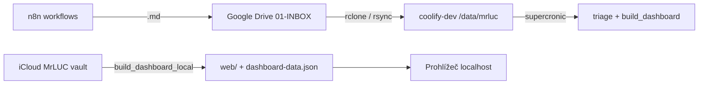

# second-brain-hub (MrLUC triage cron)

**Coolify = pouze cron** (triage, dashboard JSON do vaultu, edu news). **Dashboard UI = lokálně na Macu** (Obsidian / `http.server`).

## Architektura



| Kde | Co běží |
|-----|---------|
| **Google Drive** | `01-INBOX/{slack,sembly,email,daily}/` — SSOT pro n8n capture |
| **coolify-dev** | Docker: `triage_run.py`, `build_dashboard.py`, `edu_news_refresh.py` |
| **Mac** | Dashboard HTML + `dashboard-data.json` (žádná veřejná URL) |

INBOX root na Drive: [folder](https://drive.google.com/drive/u/0/folders/1ZaWrGl9DktNsu4K8KQZzqo2JWPtb7-ur) — ID `1ZaWrGl9DktNsu4K8KQZzqo2JWPtb7-ur`.

## Git → Coolify Auto Deploy

| Položka | Hodnota |
|---------|---------|
| Repozitář | `https://github.com/LC-RBEDU/second-brain` |
| Větev | **`main`** |
| Base directory | `vps/second-brain-hub` |
| Host | **coolify-dev** |
| Veřejná doména | **žádná** (cron-only) |

```bash
git add vps/second-brain-hub/
git commit -m "second-brain: …"
git push origin main
```

## Coolify (dev)

| | |
|--|--|
| **Projekt** | Second Brain |
| **Aplikace** | `second-brain-hub` |
| **HTTP** | Nevystaveno (bez FQDN / Traefik) |
| **Volume** | host `/data/mrluc-second-brain` → `/data/mrluc` |

### Env (runtime)

V Coolify UI u každé proměnné **Available at Runtime** (v DB `is_buildtime=false`). Build-time env se do cron kontejneru **nepropisují** — bez runtime flagu chybí `GOOGLE_*` / `CALENDAR_*` v `docker exec … env`.

| Proměnná | Význam |
|----------|--------|
| `VAULT_PATH` | `/data/mrluc` |
| `TZ` | `Europe/Prague` |
| `DASHBOARD_JSON` | `/data/mrluc/00-System/dashboard-data.json` (na VPS, ne web) |
| `LEGACY_TASKS` | `/data/mrluc/00-System/dashboard-tasks-source.json` |
| `GOOGLE_DRIVE_SA_JSON` | Obsah SA klíče (stejný jako RB Universe worker) — alternativa `GOOGLE_SERVICE_ACCOUNT_JSON` |
| `CALENDAR_USER_EMAIL` | `lukas@redbuttonedu.cz` (domain-wide delegation) |
| `CALENDAR_DAYS_AHEAD` | `2` (dnes + zítra; max 14) |

Kalendář: `cron/fetch_calendar.py` → `00-System/calendar-events.json`; `build_dashboard.py` to načte při buildu.

## Vault na VPS (sync z Macu / Drive)

MrLUC **není** v gitu. Layout na hostu = stejný jako Obsidian vault:

```
/data/mrluc/
├── 01-INBOX/slack|sembly|email|daily/
├── 02-PROJEKTY/
├── 00-System/Triage-Pending/
└── …
```

### Jednorázově na coolify-dev

```bash
sudo mkdir -p /data/mrluc-second-brain
sudo chown 1000:1000 /data/mrluc-second-brain   # UID kontejneru
```

### Sync celého vaultu (Mac iCloud → VPS)

```bash
# z repa
VPS_HOST=coolify-dev ./scripts/sync_vault_to_vps.sh
```

### Sync jen INBOX z Google Drive mirroru (Mac)

Pokud máš na Macu zrcadlo Drive (např. `~/Library/CloudStorage/GoogleDrive-…/MrLUC/`):

```bash
rsync -avz --delete \
  "$GDRIVE_MIRROR/OBSIDIAN/01-INBOX/" \
  coolify-dev:/data/mrluc-second-brain/01-INBOX/
```

Alternativa na serveru: **rclone** `drive:OBSIDIAN/01-INBOX` → `/data/mrluc-second-brain/01-INBOX/` (cron na hostu, mimo tento image).

## Cron (Europe/Prague)

| Job | Po–Pá | So–Ne |
|-----|-------|-------|
| `triage_run.py` | 7:00, 14:00, 20:00 | 7:00 |
| `build_dashboard.py` | +5 min | 7:05 |
| `edu_news_refresh.py` | 7:10 | 7:10 |
| `weekly_summary_draft.py` | — | **Ne 20:00** |
| `retro_draft.py` | — | **Ne 20:10** |
| `build_dashboard.py` (po weekly) | — | **Ne 20:15** |

Nedělní večer: drafty v `00-System/weekly/YYYY-Www-draft.md` a `00-System/Memory/retro-YYYY-Www-draft.md` → schválení skills `agenda-weekly-review`, `agenda-retro`. Revize priorit: ad-hoc `agenda-priority-review`.

`edu_news_refresh.py` (OPS2): z `02-PROJEKTY/*.md` (HOTOVO za posledních N dní + rozpracované úkoly s vysokým ICE) vybere max 5 témat pro EDU news → `00-System/edu-news-topics.json`, `dashboard-tasks-source.json` (`eduNews`), checklist v `operations.md`, pak `build_dashboard.py`.

```bash
# po natočení videa v Cursoru
VAULT_PATH=… python3 cron/edu_news_refresh.py --clear
```

Volitelně `ANTHROPIC_API_KEY` pro LLM přeřazení kandidátů (bez klíče běží heuristika).

`triage_run.py` skenuje pouze `01-INBOX/{slack,sembly,email,daily}/`.

Logy: `docker logs <container>` nebo `docker exec … tail /var/log/second-brain/*.log`

Schválení triáže: v Cursoru `schval pending triáž`.

## Waiting (čekání)

V `02-PROJEKTY/<téma>.md` u úkolu (`### F13 — …`):

```markdown
### F13 — Čekám na podpis
**Waiting | Čekat do: 2026-05-23**
```

- Při přesunu do Waiting se v JSON mění jen `p` → `Waiting` a `waitUntil`; **ICE a `dl` zůstávají**.
- Chybí-li datum → default **dnes + 3 dny** (Europe/Prague).
- Po vypršení `waitUntil` (den ≤ dnes, Europe/Prague) `build_dashboard.py` **automaticky** přepíše v hubu `**Waiting | Čekat do: …**` → `**ASAP | ICE …**` (ICE a deadline zůstanou), znovu syncne JSON a úkol jde do **top priority** scoringu.
- Ve sloupci Waiting zůstávají jen úkoly s `waitUntil` **po dnešku**.
- TOP priority (max 3) **neobsahuje** aktivní Waiting; po reaktivaci ano (ASAP + ICE).

## Dashboard lokálně (Mac)

### Auto-refresh (doporučeno)

1. **Watch** (rebuild při změně vaultu): `scripts/watch_dashboard.py` nebo `scripts/install-dashboard-watch.sh` (launchd).
2. **Serve** (polling v prohlížeči): z kořene repa `scripts/serve_dashboard.sh` → [http://127.0.0.1:8765/Dashboard.html](http://127.0.0.1:8765/Dashboard.html)

`build_dashboard.py` při každém buildu zapíše do vaultu `00-System/dashboard-data.json` a `dashboard-build-stamp.json`. UI každých ~10 s zkontroluje stamp; při novém `generated` načte JSON a překreslí panely (bez reloadu stránky).

| Režim | Chování |
|-------|---------|
| **http://127.0.0.1:8765/Dashboard.html** | Live poll stamp + data (Cache-Control: no-cache) |
| **file://** (dvojklik na `Dashboard.html`) | Poll každých 60 s (`DASHBOARD_POLL_SEC`) — načte `dashboard-data.json` vedle HTML; při úspěchu překreslí bez reloadu (zachová vyhledávání). Když prohlížeč `file://` fetch blokuje → hint v hlavičce na `serve_dashboard.sh` |

```bash
# terminál 1 — rebuild při editaci vaultu
export VAULT_PATH="$HOME/Library/Mobile Documents/iCloud~md~obsidian/Documents/MrLUC"
python3 scripts/watch_dashboard.py

# terminál 2 — server pro live UI
./scripts/serve_dashboard.sh
```

Volitelně: `DASHBOARD_POLL_SEC=5` při buildu (interval pollu v embedded JS).

### Build jednorázově

```bash
cd vps/second-brain-hub
export VAULT_PATH="$HOME/Library/Mobile Documents/iCloud~md~obsidian/Documents/MrLUC"
python3 cron/build_dashboard.py
open "$VAULT_PATH/00-System/Dashboard.html"   # file:// + meta refresh 30 s
```

Nebo dev server nad `web/` (starší workflow):

```bash
./scripts/build_dashboard_local.sh
# → Dashboard.html ve vaultu + http://127.0.0.1:8765/ (složka web/)
```

`file://` bez serveru neumí `fetch` na JSON — pro okamžitý live refresh použij `serve_dashboard.sh`.

## Lokální Docker test (cron)

```bash
docker build -t second-brain-hub:test .
docker run --rm -v "$HOME/Library/Mobile Documents/iCloud~md~obsidian/Documents/MrLUC:/data/mrluc" second-brain-hub:test
```

## Coolify bootstrap

`deploy/setup-coolify.sh` — vytvoří aplikaci **bez** veřejného FQDN. Po změně domény v minulosti:

```bash
ssh coolify-dev 'bash -s' < deploy/setup-coolify.sh   # idempotentní
# nebo ručně v DB: fqdn NULL, health_check_enabled false
```
