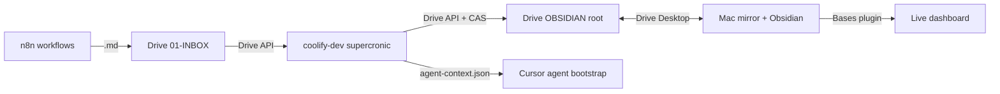

# second-brain-hub (MrLUC v2 cron — Coolify, stateless)

**Coolify = stateless cron** (lifecycle, triage, agent context, EDU news).
**Dashboard UI = nativní Obsidian Bases** (čte frontmatter live, žádný HTML build).

Detailní architektura: [`docs/sync-architecture.md`](docs/sync-architecture.md).

## Architektura v2



| Kde | Co běží |
|-----|---------|
| **Google Drive** | Vault root `1YTTsTWFzrH6cNcZfvO_R-rhmSyFvlfz-` (`SECOND_BRAIN/OBSIDIAN/`) — SSOT |
| **coolify-dev** | Docker stateless: lifecycle scripts, `triage_llm_run.py`, `lifecycle_hub_state.py`, `build_agent_context.py` — vše přes Drive API + CAS |
| **Mac** | Obsidian + Bases plugin čte frontmatter live, agent-context.json sync přes Drive Desktop |

INBOX = `OBSIDIAN/01-INBOX/{slack,sembly,email,email/sent,daily,Clippings}/`.

## Datový model v2 (file-per-task)

- **TASK** = single `.md` v `02-PROJEKTY/<slug>/tasks/<ID>-<slug>.md`
  - YAML frontmatter (id, type, project, slug, status, ice_*, deadline, waitUntil, materials, source, blocked_by) — SSOT
  - body s `## Operativní kroky` (checkboxy) + `## Poznámky / log`
- **PROJECT HUB** = `02-PROJEKTY/<Hub>.md` s charterem (Cíl, Scope, Kontext, People, Metrics, Otevřené otázky) + Bases embedy
- **MATERIAL** = `02-PROJEKTY/<slug>/materials/` nebo `05-RESOURCES/<category>/`, M:N přes `materials:` array v task frontmatteru
- **AGENT CONTEXT** = `00-System/agent-context.json` snapshot pro Cursor agenta (every-write trigger / cron 15 min)
- **ARCHIV** = `07-ARCHIV/tasks-done/<slug>/<ID>-*.md` (po 90 dnech / Done)

Detaily: vault `00-System/Templates/agenda-system.md`.

## Git → Coolify Auto Deploy

| Položka | Hodnota |
|---------|---------|
| Repozitář | `https://github.com/LC-RBEDU/second-brain` |
| Větev | **`main`** |
| Base directory | `vps/second-brain-hub` |
| Host | **coolify-dev** |
| Veřejná doména | **žádná** (cron-only) |

```bash
git add vps/second-brain-hub/
git commit -m "second-brain: …"
git push origin main
```

## Coolify (dev) — env

| Proměnná | Význam |
|----------|--------|
| `VAULT_DRIVE_ID` | `1YTTsTWFzrH6cNcZfvO_R-rhmSyFvlfz-` — OBSIDIAN root |
| `GOOGLE_DRIVE_OAUTH_JSON` | OAuth single-line JSON |
| `GOOGLE_DRIVE_SA_JSON` | volitelný SA fallback |
| `TZ` | `Europe/Prague` |
| `CALENDAR_USER_EMAIL` | `lukas@redbuttonedu.cz` (DWD pro kalendář) |
| `CALENDAR_DAYS_AHEAD` | `2` (max 14) |
| `ANTHROPIC_API_KEY` | volitelné — LLM rerank EDU news + commitment extraction |
| `ANTHROPIC_MODEL` | default `claude-3-5-haiku-20241022` |
| `CURSOR_API_KEY` | **LLM triáž** (`triage_llm_run.py`) — user API key z Cursor Dashboard → API Keys |

**Smazané (legacy v1):** `VAULT_PATH`, `DASHBOARD_JSON`, `LEGACY_TASKS`.

## Cron (Europe/Prague) — viz `deploy/crontab`

### v2 lifecycle (every 2 hours, staggered :00–:06)

| Job | Čas | Co dělá |
|-----|-----|---------|
| `lifecycle_done_from_checkboxes.py` | every 2h :00 | Všechny `[x]` → `status: Done` |
| `lifecycle_waiting_to_asap.py` | every 2h :01 | `Waiting` + `waitUntil` ≤ dnes → `ASAP` (smaže `waitUntil`) |
| `lifecycle_waiting_default_waituntil.py` | every 2h :02 | `Waiting` bez `waitUntil` → doplní `dnes + 3 dny` |
| `lifecycle_waituntil_hygiene.py` | every 2h :03 | `waitUntil` vyčistí u tasků, kde `status != Waiting` |
| `lifecycle_overdue_flag.py` | every 2h :04 | Append `OVERDUE` log do body |
| `archive_done_tasks.py` | every 2h :05 | `Done` > 90 dní → `07-ARCHIV/tasks-done/<slug>/` |
| `lifecycle_recurring.py` | every 2h :06 | Recurring `Done` → archive + nová instance |
| `lifecycle_asap_backfill.py` | hourly 10:00–02:00 | `ASAP` < 3 → promote top `Next` (`today_score`) |
| `build_agent_context.py` | každých 15 min v 7-22 | refresh `00-System/agent-context.json` |

### Triage / EDU news / Weekly

| Job | Po-Pa | So-Ne |
|-----|-------|-------|
| `triage_llm_run.py` | 7:00, 14:00, 20:00 | 7:00 |
| `inbox_inventory.py` | Po 6:55 | — |
| `lifecycle_extra_edu_news.py` | 7:10 | 7:10 |
| `weekly_summary_draft.py` | — | Ne 20:00 |
| `retro_draft.py` | — | Ne 20:10 |

### Schválení triáže

V Cursoru: `schval pending triáž` / `apply batch` (skill `agenda-triage`, mode PENDING).

### Manuální EDU news reset (po nahrání videa)

```bash
GOOGLE_DRIVE_OAUTH_JSON="$(cat ~/.config/mrluc/oauth_creds.json)" \
VAULT_DRIVE_ID=1YTTsTWFzrH6cNcZfvO_R-rhmSyFvlfz- \
python3 cron/lifecycle_extra_edu_news.py --reset
```

Logy: `docker logs <container>` nebo `docker exec … tail /var/log/second-brain/*.log`.

## Lifecycle pravidla v2

### Status flow
`Backlog → Next → ASAP → Done` (happy path)
`Next → Waiting (waitUntil) → ASAP → Done` (čekání s reaktivací)
`Next → Done (cancel reason v body)` (zrušeno bez archivu)

### Recurring
- Filename `<ID>.md` (bez slugify suffix), 1 aktivní instance
- `recurring:` blok ve frontmatteru (frequency, weekday/interval, reset_body_sections)
- Po `Done` → `lifecycle_recurring.py` archivuje + vytvoří next instance
- `extra_module: edu_news` — volá `lifecycle_extra_edu_news.py` při refresh / reset

### CAS (compare-and-swap)
Každý zápis nese `expect_mtime`. Pokud user mezitím upravil v Obsidianu, cron se přeskočí (warning v logu).

## Lokální Docker test

```bash
docker build -t second-brain-hub:test .
docker run --rm \
  -e VAULT_DRIVE_ID=1YTTsTWFzrH6cNcZfvO_R-rhmSyFvlfz- \
  -e GOOGLE_DRIVE_OAUTH_JSON="$(cat ~/.config/mrluc/oauth_creds.json)" \
  second-brain-hub:test
```

## Lokální agent-context refresh (mac)

```bash
python3 ../../scripts/build_agent_context.py
```

(píše `OBSIDIAN/00-System/agent-context.json` přes Drive Desktop mirror — pro Cursor agent bootstrap.)

## Související

- `OBSIDIAN/00-System/agent-bootstrap.md`
- `OBSIDIAN/00-System/Templates/agenda-system.md` — kompletní průvodce v2
- `.cursor/rules/second-brain-bootstrap.mdc` — always-applied agent rule
