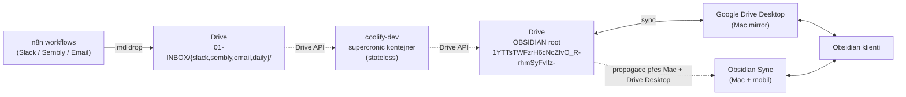

# Sync architecture — Drive API jako SSoT

## Datový tok

## Klíčové vlastnosti

- **Drive folder `1YTTsTWFzrH6cNcZfvO_R-rhmSyFvlfz-`** = OBSIDIAN root = jediný zdroj pravdy
  - Drive nadřazený folder `1FYeCEsC6rRtZPayjToEJqwGWAZax3eRD` (`SECOND_BRAIN`) drží i repo (`vps/`, `ŠABLONY/`, `.cursor/` atd.) — vault je `SECOND_BRAIN/OBSIDIAN/`
  - Vlastník: `lukas@redbuttonedu.cz` (Workspace org)
- Kontejner `second-brain-hub` na coolify-dev:
  - **stateless** — žádný volume mount, žádný lokální mirror
  - all I/O přes Google Drive API v3 (OAuth user delegation)
  - `/data/mrluc/` neexistuje, jen `/var/log/second-brain/` pro logy uvnitř kontejneru
- **Mac:** Obsidian otevírá vault z cesty na Google Drive Desktop mirror; výsledky cronu sem dorazí přes Drive → mirror.
- **Mobil (od 2026-05-22):** stejný vault přes **Obsidian Sync** (aktivní) — úpravy hubů / INBOX / Tasks na telefonu; na Drive se propsou po sync na Macu (Drive Desktop upload). Cron je nečte přímo z Obsidian Sync.
- INBOX = `OBSIDIAN/01-INBOX/` — v kódu pracujeme s VAULT root ID a relativními cestami

## Klienti vaultu (kdo jak syncuje)

| Klient | Mechanismus | Poznámka |
|--------|-------------|----------|
| n8n | Google Drive API | drop `.md` do `01-INBOX/` |
| Cron (`second-brain-hub`) | Google Drive API (OAuth) | stateless, žádný volume |
| Cursor / agent (Mac) | Cesta na Drive Desktop mirror | repo `SECOND_BRAIN` mimo vault |
| Obsidian Mac | Drive Desktop cesta + **Obsidian Sync** | Sync pro konzistenci s mobilem |
| Obsidian mobil | **Obsidian Sync** | bez Drive app; viz `OBSIDIAN/00-System/Memory/vault-gdrive-migration.md` |

## Auth: OAuth user delegation

**Rozhodnutí:** OAuth user delegation > Service Account.

| Důvod | Detail |
|---|---|
| Drive vlastník je single-user | Vault je v personal Drive `lukas@redbuttonedu.cz`, ne na shared drive. SA bez DWD nemá kvótu vytvářet soubory v personal Drive (uploads selžou s `storageQuotaExceeded`). |
| DWD je drahá komplikace | Vyžadovala by Google Workspace admin → Domain-wide Delegation, kterou tady nemáme. |
| OAuth refresh token je stabilní | Token nevyprší, pokud OAuth consent screen je v `In production` (Workspace org), což u rb edu je default. |
| Stejné scope | `https://www.googleapis.com/auth/drive` full R/W. |

**Setup flow (jednorázově):**

1. GCP project + Desktop App OAuth client → `~/.config/mrluc/oauth_client.json`
2. `python3 scripts/oauth_setup.py` — browser flow, sign in jako `lukas@redbuttonedu.cz`
3. Skript napíše `~/.config/mrluc/oauth_creds.json` (`client_id`, `client_secret`, `refresh_token`, `token_uri`, `scopes`)
4. Obsah toho JSONu jde do Coolify env `GOOGLE_DRIVE_OAUTH_JSON` (single-line)

**Runtime:** kontejner načte env, `lib/drive_io.credentials_from_env()` vytvoří `OAuthCredentials` z refresh tokenu, `googleapiclient` automaticky obnoví access token před každým requestem.

**Fallback:** `lib/drive_io` umí i Service Account (`GOOGLE_DRIVE_SA_JSON` + volitelně `GOOGLE_DRIVE_IMPERSONATE` pro DWD). Není použité, ale zůstává v kódu pro budoucí cases (např. shared drive).

## Race control: hub `.md` přepis

`build_dashboard.py` přepisuje `02-PROJEKTY/<slug>.md` při reaktivaci Waiting→ASAP po vypršení `waitUntil`. User mezitím píše stejný soubor v Obsidianu (přes Drive Desktop). Race window může být do ~60 s (interval Drive Desktop sync).

**Mitigace:** mtime-based CAS (Compare-and-Swap).

1. `read_text(rel)` vrátí text + `modifiedTime` jako součást meta
2. Cron rozhodne, co přepsat
3. `write_text(rel, new_text, expect_mtime=...)` před upload re-fetchne aktuální `modifiedTime` z Drive a porovná
4. Pokud aktuální `modifiedTime > expect_mtime` → **skip, log warn**, retry až další cron iterace
5. Reaktivace se aplikuje až bude soubor stabilní (žádné aktivní psaní)

Drive `modifiedTime` má sec-granularitu (ISO 8601 s ms). False-positive konflikt může nastat jen pokud user a cron stihnou zapsat ve stejné sekundě → akceptovatelné, další cron run to dorovná.

## Atomic operations

| Operace | Drive API | Atomicita |
|---|---|---|
| `write_text` | `files.update(media_body=...)` nebo `files.create` | Drive garantuje per-file atomic |
| `move` (např. `01-INBOX/x.md` → `07-ARCHIV/inbox-processed/2026/05/x.md`) | `files.update(addParents=dst, removeParents=src)` | 1 API call, atomic |
| `mkdir_p` | iterace `files.list(name=, mimeType=folder)` + `files.create(mimeType=folder)` | per-folder, idempotentní |
| `delete` | `files.update(trashed=true)` (default) nebo `files.delete()` | per-file, atomic |

## Retry a rate limiting

- Drive API quota: 1000 req / 100s per uživatel, my máme ~30-50 req per cron run, 3-5 runs/den → hluboko pod limity
- Backoff: exponential s jitterem na status `429`, `500-599`, `socket.error`, `httplib2.ServerNotFoundError`
- Max 5 pokusů, base delay 1s, max delay 30s

## Path resolution & caching

- `DriveVault.resolve(rel_path)` převede `"02-PROJEKTY/Finance.md"` na `fileId` přes postupný `files.list(name=<segment>, parents=<parent_id>)`
- Per-instance LRU cache `path → fileId` (typický cron run hit-rate >90 %)
- Cache invalidace: žádná během runu (jeden cron = jedna instance = jedna konzistentní view)
- Při `write_text` po `mkdir_p` cache update inline

## Lokální dev fallback (volitelné, není MVP)

`DriveVault` má designově prostor pro `LocalVault` alternativu se stejným interface (pro běh skriptů z Macu mimo container, kdy SA creds chybí). Není v scope této migrace — Mac Obsidian používáme jen pro čtení/psaní přes Drive Desktop, ne pro spouštění cronu.

## Co se MĚNÍ

- žádný `VAULT_PATH=/data/mrluc` v Coolify env / Dockerfile / crontab
- žádný volume `/data/mrluc-second-brain` → `/data/mrluc` na hostu
- `/data/mrluc-second-brain` na coolify-dev po cutoveru smažeme (Phase 5)
- `scripts/sync_vault_to_vps.sh` smažeme (Mac-as-source dead end)
- `cron/*.py` čte/píše skrz `lib/drive_io.DriveVault`, ne `pathlib.Path`

## Co se NEMĚNÍ

- n8n workflowy (drop souborů do Drive už funguje)
- Google Calendar fetch (`fetch_calendar.py` používá jiný scope, jiný subject)
- Mac Obsidian path (Drive Desktop mirror); **Obsidian Sync** aktivní Mac + mobil (2026-05-22)
- Supercronic scheduling, časy běhů, log formát
- Dashboard UI (`web/app.js`, `styles.css`, HTML structure)

## Out of scope

- Drive Push Notifications (real-time triage) — možné v budoucnu, dnes není potřeba
- Bidi sync víc vaultů
- Migrace `ŠABLONY/n8n/*.json` na nové INBOX ID — řeší se v Phase 5 (kosmetika)
